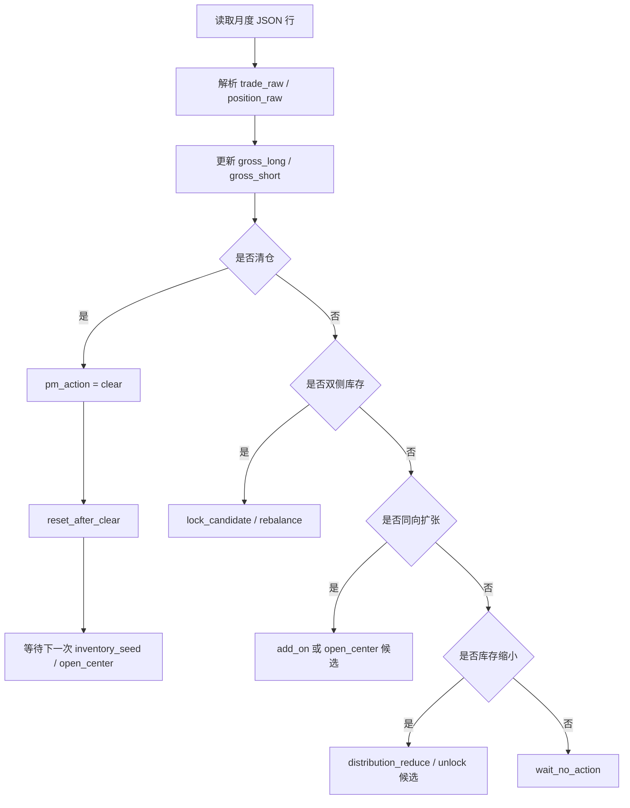

# 原始立花义正交易法 v0.1 回测规格

## 版本定位

本文件冻结 `原始立花义正交易法 v0.1` 与 `Tachibana Position Management v0.1` 的最小定义，并作为后续回测代码的规格合同。

当前阶段已经结束“大面积阅读/提取”主线。后续只有在规则歧义、事实冲突或字段无法落地时，才回查原书关键页与月度交易谱。

本文件不是 A 股适配版，不引入周线、月线、多周期系统，也不修改 MALF 主定义。

## 证据纪律

交易事实裁决顺序遵守 [evidence-precedence.md](./evidence-precedence.md)：

1. `data/pioneer-1975-1976/source-images/` 下的 24 张月度交易谱截图
2. 原始月度交易谱 PDF
3. `data/pioneer-1975-1976/json/` 下的重建 JSON
4. 章节原文 PDF / 图片页
5. OCR 文本，仅作检索辅助

所有 `trade_raw`、`position_raw` 的方向语义只能标为“我们的抽象解释”，不能冒充原文。回测实现必须保留原始字段与解释字段的分离。

## 原始交易法定义

`原始立花义正交易法 v0.1` 是一个日线波段交易方法。它处理单一交易对象在日线级别上的试探、分批、加码、减仓、清仓、反手、等待和复盘。

### 交易对象

| 项 | v0.1 定义 |
|---|---|
| 标的 | Pioneer 1975-1976 月度交易谱 |
| 级别 | 日线 |
| 交易单位 | 交易谱手数；日本改交易规则前一手为 1000 股，v0.1 回测先以“价格点 × 手数”列账。 |
| 价格 | 每日收盘价、交易价 |
| 交易记录 | 月度 JSON 中的 `trade_raw`、`position_raw` |
| 回测目标 | 复现并解释原始立花法的动作和仓位状态，不追求生成可交易收益曲线 |

### 交易时点纪律

立花义正的下单流程不是“看当天收盘价后当天成交”。v0.1 必须采用以下时点纪律：

| 字段/概念 | v0.1 定义 |
|---|---|
| `decision_basis_date` | 下单判断所依据的日期，通常是上一有效交易日的收盘价记录。 |
| `execution_date` | 交易记录所在日期；当日开盘前电话下市价单。 |
| `trade_price` | `execution_date` 的开盘成交价，通常由第二天报纸回填。 |
| `close_price` | `execution_date` 的收盘价，只能用于盘后记录和盯市，不能用于生成当日交易。 |
| `execution_timing` | v0.1 固定为 `pre_open_market_order`。 |

因此，任何后续自动信号或 MALF 接入都不得使用交易行同日 `close_price` 来解释该行交易发生原因。PM 状态回放可以在成交日更新库存；绩效回测可以在成交后用同日收盘价盯市。

### 交易谱记号语义

立花交易谱的横杠不是普通负号。v0.1 采用以下记号语义：

| 原始写法 | v0.1 解释 |
|---|---|
| `—5` | 买入 5 张，增加多头或减少空头。 |
| `5—` | 卖出 5 张，增加空头或减少多头。 |
| `10—` | 未平仓为空头 10 张。 |
| `—5` | 未平仓为多头 5 张。 |
| `10—5` | 未平仓同时包含空头 10 张、多头 5 张。 |

因此，`position_raw` 中横杠左侧映射为 `gross_short`，横杠右侧映射为 `gross_long`。例如 `2—20` 应解析为 `gross_short = 2`、`gross_long = 20`。这条规则优先于早期“左侧/右侧”抽象描述。

### 核心动作

| 动作代码 | 定义 | v0.1 回测处理 |
|---|---|---|
| `trend_probe_entry` | 在方向可能形成但尚未完全确认时小仓试探。 | 可由交易记录与人工动作标注共同驱动。 |
| `trend_confirmation_add` | 原方向运行后继续同向加码。 | 可自动识别同向库存扩张，动作原因需人工标注。 |
| `pullback_entry` | 借回撤建立试探仓位。 | 暂需 MALF 背景或人工结构标注。 |
| `pullback_add` | 已有仓位后，在回撤和再推进中追加同向仓位。 | 暂需 MALF 背景或人工结构标注。 |
| `distribution_reduce` | 分批减仓、兑现或收回风险。 | 可自动识别库存缩小，是否利润保护需人工标注。 |
| `exit_on_rhythm_failure` | 节奏失效或仓位逻辑不成立时退出。 | 退出事实可自动识别，原因需人工标注。 |
| `reversal_flip` | 平掉原方向后切换方向。 | 可通过清仓前后方向变化候选识别，最终需人工确认。 |
| `inventory_rebalance` | 围绕双侧库存、中心单、加码单、均价进行调整。 | 可自动维护库存，动作语义需人工标注。 |
| `wait_no_action` | 主动等待，不因无交易而硬生成信号。 | 可自动生成日级状态，等待原因不自动推断。 |

### 方法原则

| 原则代码 | v0.1 定义 | 回测含义 |
|---|---|---|
| `staged_execution` | 建仓、加码、退出以分批为基本形式。 | 允许多笔动作构成一个交易段。 |
| `active_waiting` | 等待是交易动作的一部分。 | 无交易日输出 `wait_no_action`，不等同于无规则。 |
| `accept_and_correct` | 错误后通过清仓、减仓、重试恢复秩序。 | `clear` 后必须允许新交易段重新开始。 |
| `anti_prediction_first` | 不把观点、预测或广告式信息作为回测信号。 | v0.1 不接入新闻、基本面、主观预测。 |
| `profit_protection` | 保护利润和账户稳定优先于漂亮预测。 | 分批退出、锁单候选、清仓可作为利润保护动作候选。 |

## Position Management v0.1

`Tachibana Position Management v0.1` 是本规格最关键的层。它不判断行情方向，只维护仓位结构、库存暴露、中心单候选、加码单、锁单候选、清仓与重置。

### 关键术语冻结

| 术语 | v0.1 冻结定义 | 触发/识别 | 状态影响 |
|---|---|---|---|
| `center_position` | 当前交易段的仓位骨架，代表交易者愿意围绕其继续加减、保护或收束的核心库存。 | 不能纯自动确认；由人工标注或强样本指定，自动规则只能生成 `center_candidate`。 | 写入 `center_side`、`center_size`，作为区分 `add_on`、`reduce_add_on`、`reduce_center` 的前提。 |
| `add_on` | 围绕已存在中心单候选发生的同向库存扩张。 | 同侧库存增加，且当前交易段已有 `center_position` 或 `center_candidate`。 | 增加 `add_on_size`；若扩张明显超过前序节奏，触发 `scale_alert` 候选。 |
| `gross_long/gross_short` | 分别保存多头与空头总库存的底层事实字段。 | 每个有 `position_raw` 的交易日解析更新；无交易日沿用上一有效库存。 | `position_raw` 横杠右侧为 `gross_long`，横杠左侧为 `gross_short`。 |
| `lock_candidate` | 同时存在左右两侧库存时的锁单候选，不等于正式锁单。 | `gross_long > 0` 且 `gross_short > 0`。 | `lock_status = candidate`，`lock_candidate_size = min(gross_long, gross_short)`。 |
| `unlock` | 双侧库存解除一侧，变回单侧库存。 | 前一状态为双侧库存，当前状态只有一侧库存大于 0。 | `lock_status = released`，保留剩余单侧库存，交易段不必自动结束。 |
| `clear` | 左右两侧库存全部归零。 | `gross_long = 0` 且 `gross_short = 0`。 | 输出 `pm_action = clear`，随后必须执行 `reset_after_clear`。 |
| `reset_after_clear` | 清仓后旧交易段终止，中心单、加码单、锁单候选全部失效。 | 每次 `clear` 后自动执行。 | 递增下一交易段编号；清空 `center_side`、`center_size`、`add_on_size`、`lock_candidate_size`。 |
| `inventory_seed` | 清仓后或月末留下的新段初始库存，可能发展为下一段中心单候选。 | 清仓后的首次非零库存，或跨月延续的非零库存。 | 开启或延续新 `segment_id`，写入 `open_center` 候选但不自动确认中心单。 |

### 状态字段

| 字段 | 类型 | 定义 | 生成方式 |
|---|---|---|---|
| `segment_id` | string | 当前交易段编号。 | 清仓到零后下一次建仓递增。 |
| `gross_long` | number | 多头总手数；来自 `position_raw` 横杠右侧。 | 从 `position_raw` 解析。 |
| `gross_short` | number | 空头总手数；来自 `position_raw` 横杠左侧。 | 从 `position_raw` 解析。 |
| `net_position` | number | 净持仓，仅作辅助。 | `gross_long - gross_short`，不得替代双侧库存。 |
| `center_side` | enum | 中心单候选方向：`long / short / mixed / none`。 | 人工标注优先，自动规则只能给候选。 |
| `center_size` | number | 中心单候选手数。 | v0.1 主要人工标注。 |
| `add_on_size` | number | 围绕中心单追加的同向手数。 | 库存扩张可自动估算。 |
| `average_price_long` | number/null | 多头库存均价。 | 需要交易价完整时计算。 |
| `average_price_short` | number/null | 空头库存均价。 | 需要交易价完整时计算。 |
| `lock_candidate_size` | number | 双侧同时存在时的锁单候选规模。 | `min(gross_long, gross_short)`。 |
| `lock_status` | enum | `none / candidate / confirmed / released`。 | v0.1 默认只能到 `candidate`，`confirmed` 需书页校勘。 |
| `pm_action` | enum | 仓位动作。 | 由状态转移生成，人工可覆盖。 |
| `scale_alert` | boolean | 加码尺度警戒。 | v0.1 用候选规则触发，阈值后续校验。 |
| `exit_mode` | enum | `none / one_shot_clear / staged_distribution / unlock_then_clear`。 | 由库存收缩路径生成。 |

### PM 动作定义

| `pm_action` | 定义 | 自动化状态 |
|---|---|---|
| `open_center` | 建立可能成为中心单的初始仓位。 | 候选自动化，最终人工确认。 |
| `inventory_seed` | 清仓后或月末保留的新段库存种子。 | 可自动识别，需人工解释。 |
| `add_on` | 同向增加库存。 | 可自动识别。 |
| `reduce_add_on` | 优先收回加码单或额外库存。 | 需中心单标注后才能自动区分。 |
| `reduce_center` | 缩小中心单本身。 | 需人工确认。 |
| `rebalance` | 双侧或复杂库存调整。 | 候选自动化。 |
| `lock_candidate` | 同时持有双侧库存，可能是锁单。 | 可自动识别候选。 |
| `unlock` | 双侧库存解除一侧。 | 可自动识别。 |
| `clear` | 所有库存归零。 | 可自动识别。 |
| `reset_after_clear` | 清仓后旧交易段结束，中心单与加码单清空。 | 必须自动执行。 |

### 状态转移影响

| 转移 | 条件 | `pm_action` | 必须更新 |
|---|---|---|---|
| 空仓到单侧库存 | 前一日双侧为 0，当前一侧大于 0。 | `inventory_seed` 或 `open_center` 候选 | 新 `segment_id`、`gross_long/gross_short`、`center_candidate`。 |
| 单侧库存同向增加 | 当前同侧库存大于上一有效库存。 | `add_on` 或 `open_center` 候选 | `add_on_size`、`scale_alert` 候选。 |
| 单侧库存减少但未归零 | 当前同侧库存小于上一有效库存且仍大于 0。 | `reduce_add_on` 或 `reduce_center` 候选 | `exit_mode` 候选、剩余库存。 |
| 单侧库存归零 | 当前双侧库存全为 0。 | `clear` | `reset_after_clear`。 |
| 单侧转双侧 | 当前两侧库存均大于 0。 | `lock_candidate` 或 `rebalance` | `lock_status`、`lock_candidate_size`、双侧库存。 |
| 双侧库存调整 | 当前两侧库存均大于 0，任一侧数量变化。 | `rebalance` | `gross_long/gross_short`、`lock_candidate_size`。 |
| 双侧转单侧 | 前一状态双侧，当前只剩一侧。 | `unlock` | `lock_status = released`、剩余单侧库存。 |
| 双侧转空仓 | 前一状态双侧，当前双侧为 0。 | `clear` | `reset_after_clear`。 |

### 必须冻结的 PM 规则

| 规则代码 | v0.1 定义 | 支撑样本 |
|---|---|---|
| `preserve_dual_inventory` | 双侧库存必须保存为 `gross_long/gross_short`，不能压成净仓位。 | [1976-04](../tachibana/monthly/1976-04.md)、[1976-05](../tachibana/monthly/1976-05.md) |
| `reset_after_clear` | 一旦 `gross_long = 0` 且 `gross_short = 0`，旧交易段结束。 | [1976-03](../tachibana/monthly/1976-03.md)、[1976-11](../tachibana/monthly/1976-11.md) |
| `center_then_add_on` | 若已有中心单候选，同向扩张拆为中心单与加码单。 | [1976-10](../tachibana/monthly/1976-10.md)、[1976-12](../tachibana/monthly/1976-12.md) |
| `lock_requires_confirmation` | 双侧库存只能先标 `lock_candidate`，不得自动定论为锁单。 | [1976-04](../tachibana/monthly/1976-04.md) |
| `allow_unlock_then_clear` | 双侧库存解除一侧后，可继续单侧持有，再最终清仓。 | [1976-05](../tachibana/monthly/1976-05.md) |
| `allow_one_shot_clear` | 极端仓位或节奏失败时允许一次性清仓。 | [1976-11](../tachibana/monthly/1976-11.md) |
| `allow_staged_distribution` | 大仓位推进后允许分批退出，再最终清仓。 | [1976-12](../tachibana/monthly/1976-12.md) |
| `add_on_scale_alert` | 当同向扩张明显大于前序节奏，输出尺度警戒候选。 | [1976-11](../tachibana/monthly/1976-11.md)、[1976-12](../tachibana/monthly/1976-12.md) |

## 回测输入

### 必需输入

| 输入 | 路径 | 用途 |
|---|---|---|
| 月度 JSON | `data/pioneer-1975-1976/json/*.json` | 日线价格、交易价、原始交易、原始持仓。 |
| 证据裁决规则 | [evidence-precedence.md](./evidence-precedence.md) | 冲突处理。 |
| 方法定义 | 本文件 | 状态转移和输出字段。 |

### 可选输入

| 输入 | 用途 |
|---|---|
| 月度截图 | 校验 JSON 与关键交易事实。 |
| 章节原文锚点 | 只在动作语义或锁单确认有歧义时回查。 |
| MALF 快照 | 提供 `wave / range / break / progress / probability` 背景。 |
| 人工标注表 | 标注中心单、动作原因、锁单确认、节奏失败等非自动字段。 |

## 回测输出

v0.1 回测输出不是单一收益曲线，而是“交易事实 + 方法解释 + PM 状态”的日级回放表。

### 日级输出字段

| 字段 | 含义 |
|---|---|
| `date_key` | `YYYY-MM-DD` 或 `YYYY-MM` + day。 |
| `symbol` | 标的。 |
| `close_price` | 收盘价。 |
| `trade_price` | 交易价。 |
| `decision_basis_date` | 交易判断依据日期，交易行通常指向上一有效收盘日。 |
| `execution_timing` | 交易行固定为 `pre_open_market_order`。 |
| `same_day_close_available_at_order` | 交易行固定为 `false`，防止同日收盘价被误用为下单依据。 |
| `trade_raw` | 原始交易写法。 |
| `position_raw` | 原始持仓写法。 |
| `gross_long` / `gross_short` | 双侧库存。 |
| `net_position` | 净持仓辅助值。 |
| `segment_id` | 当前交易段。 |
| `method_action` | Method 动作代码。 |
| `pm_action` | PM 动作代码。 |
| `center_side` / `center_size` | 中心单候选。 |
| `add_on_size` | 加码单候选。 |
| `lock_status` / `lock_candidate_size` | 锁单候选状态。 |
| `exit_mode` | 退出模式。 |
| `scale_alert` | 加码尺度警戒。 |
| `malf_context` | 可选 MALF 背景。 |
| `evidence_level` | `fact / book_self_statement / our_interpretation / malf_mapping / manual_annotation`。 |
| `source_anchor` | 月报、截图、章节或人工标注来源。 |

### 汇总输出

| 输出 | 含义 |
|---|---|
| `segment_summary` | 每个交易段的起止、最大双侧暴露、中心单候选、退出模式。 |
| `pm_event_log` | `open_center / add_on / lock_candidate / unlock / clear` 等事件序列。 |
| `manual_review_queue` | 需要人工校勘的日期、动作和原因。 |
| `rule_coverage_report` | 自动化、人工标注、暂不回测字段的覆盖率。 |

## 自动化边界

### v0.1 可以自动化

| 项 | 说明 |
|---|---|
| 解析日线价格与交易价 | 来自 JSON。 |
| 解析原始交易和持仓字段 | 保留 `trade_raw`、`position_raw`。 |
| 标记下单/成交时点 | 交易行输出 `decision_basis_date` 与 `execution_timing`。 |
| 维护 `gross_long/gross_short` | 双侧库存是 PM 的底层事实。 |
| 识别清仓 | 双侧库存同时归零。 |
| 执行 `reset_after_clear` | 清空中心单、加码单、锁单候选并递增交易段。 |
| 识别同向加码 | 同侧库存增加。 |
| 识别库存缩小 | 同侧库存减少。 |
| 识别双侧库存 | 触发 `lock_candidate`。 |
| 识别解锁候选 | 双侧库存转为单侧库存。 |
| 识别一次性清仓与分批退出路径 | 根据库存收缩序列生成 `exit_mode` 候选。 |
| 生成等待日 | 无交易但保留价格与持仓状态。 |

### v0.1 必须人工标注

| 项 | 原因 |
|---|---|
| `center_position` 最终确认 | 不能仅凭数值自动推断“中心单”。 |
| `method_action` 的原因 | 试探、回撤、节奏失败、利润保护需要语境。 |
| `lock_status = confirmed` | 双侧库存不等于正式锁单。 |
| `profit_protection` 最终判断 | 分批退出可能是利润保护，也可能是风险收束。 |
| `reversal_flip` 最终确认 | 需要区分清仓后新段、普通反向库存和真正反手。 |
| MALF 背景解释 | MALF 只提供结构，不自动解释交易者意图。 |

### v0.1 暂不回测

| 项 | 暂缓原因 |
|---|---|
| A 股涨跌停、T+1、印花税、滑点 | 属于 A 股适配版。 |
| 选股规则 | 当前只覆盖 Pioneer 单标的。 |
| 资金曲线和真实账户杠杆 | 原始资料不足以稳定定义资金基数。 |
| 心理状态自动化 | 克制、认错、去虚荣只能作为人工解释标签。 |
| 周线/月线结构 | 当前冻结为日线。 |
| 自动交易信号生成 | 本阶段目标是复现和解释，不是部署策略。 |

## MALF 接口

MALF 在 v0.1 中只提供结构背景：

```text
wave / range / break / progress / probability
```

MALF 不管理仓位，不管理心理，不管理锁单，不决定中心单，不决定加码手数，不决定清仓模式。

| MALF 字段 | Method/PM 使用方式 | 禁止用法 |
|---|---|---|
| `wave` | 提供价格波段背景。 | 不能直接生成 `open_center`。 |
| `range` | 提供等待或盘整背景。 | 不能把所有无交易自动解释为 range。 |
| `break` | 提供旧节奏失效或新结构出生背景。 | 不能自动定论为 `reversal_flip`。 |
| `progress` | 描述推进程度。 | 不能决定加码规模。 |
| `probability` | 作为结构概率背景。 | 不能覆盖仓位纪律和利润保护。 |

MALF 输出应写入 `malf_context`，并以 `malf_mapping` 证据层参与解释。若 MALF 与交易事实冲突，交易事实优先。

## 最小状态转移



## 强样本校验集

| 样本 | 事实链 | v0.1 应输出 |
|---|---|---|
| [1976-03](../tachibana/monthly/1976-03.md) | `—12 -> 0 -> —10` | `clear -> reset_after_clear -> inventory_seed` |
| [1976-04](../tachibana/monthly/1976-04.md) | `— 10 -> 2 — 20 -> 4 — 5` | `preserve_dual_inventory -> lock_candidate -> rebalance` |
| [1976-05](../tachibana/monthly/1976-05.md) | `4 — 5 -> 10 — 5 -> 10 — -> 0` | `unlock -> 单侧库存延续 -> clear` |
| [1976-10](../tachibana/monthly/1976-10.md) | `—10 -> —24` | `inventory_seed/open_center -> add_on` |
| [1976-11](../tachibana/monthly/1976-11.md) | `—24 -> —200 -> 0` | `add_on -> scale_alert -> one_shot_clear -> reset_after_clear` |
| [1976-11](../tachibana/monthly/1976-11.md) | `—5 -> 0 -> —5 -> 35 —` | `probe -> clear -> probe -> reversal_flip candidate -> new center candidate` |
| [1976-12](../tachibana/monthly/1976-12.md) | `35 — -> 150 — -> 100 — -> 50 — -> 0` | `center_then_add_on -> scale_alert candidate -> staged_distribution -> clear` |

## 实现顺序

1. 实现 JSON 读取与日级标准化表。
2. 实现 `trade_raw`、`position_raw` 的双侧库存解析器。
3. 实现 PM 状态机：`gross_long/gross_short`、`clear`、`reset_after_clear`、`lock_candidate`、`unlock`。
4. 加入人工标注接口：`center_position`、`method_action`、`lock_status`、`method_reason`。
5. 输出日级回放表、交易段汇总、人工复核队列。
6. 再接入 MALF 结构快照，只作为背景字段。
7. 最后才讨论 A 股适配版。

## v0.1 冻结结论

- 继续大面积读书的边际收益已经低于定义和回测规格建设。
- 原始立花法回测的第一目标是“复现动作与仓位结构”，不是追求收益优化。
- PM 层是最关键的中间层；没有 PM，中心单、加码、锁单、清仓、利润保护都会被错误压缩为普通买卖信号。
- MALF 只做结构背景，不接管仓位、心理和锁单。
- 下一步应进入最小回测原型，但原型只覆盖原始立花法，不做 A 股适配。
