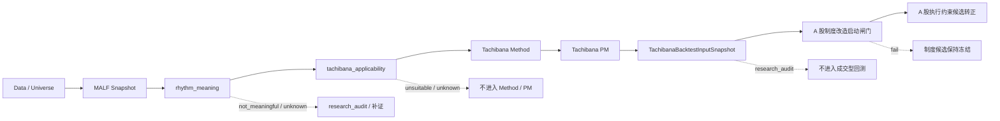

# MALF-立花前置认知过滤器攻坚总控矩阵 v0.1

## 版本定位

- 本文件是“先把 MALF 作为立花法前置认知过滤器做实”的总控验收矩阵。
- 它不新增 MALF 定义，不新增 Tachibana Method / PM 规则，不新增 A 股制度规则。
- 它只汇总五步攻坚计划的产物、证据、边界铁律、当前缺口和下一步动作。
- 它是审计索引，不是交易信号、选股公式、回测结果或实盘规则。

## 总目标

攻坚主线不是“怎么改规则”，而是回答：

> 什么结构条件下，立花义正波段交易法的仓位节奏才值得进入 Method / PM 讨论？

因此，本轮总控只以一个标准验收所有产物：是否让 `Data -> MALF -> rhythm_meaning -> tachibana_applicability -> Method / PM -> Backtest Input -> A 股制度启动闸门` 的链路更可判定、更可复核、更不容易被交易裁决污染。

## 五步攻坚状态矩阵

| 步骤 | 原始问题 | 当前核心产物 | 当前状态 | 尚未完成 |
|---|---|---|---|---|
| 1. MALF 适配资格判定 | 什么结构才配进入立花节奏讨论？ | [MALF-立花前置认知过滤器 v0.1](./MALF-立花前置认知过滤器-v0.1.md)、[MALF-立花结构资格横向判读矩阵 v0.1](./MALF-立花结构资格横向判读矩阵-v0.1.md) | 定义层成立；历史样本第一轮成立。 | 真实 A 股 MALF 快照尚未接入。 |
| 2. 立花法分层边界 | MALF、Method、PM、A 股适配谁管什么？ | [Tachibana 分层边界审计 v0.1](./Tachibana-分层边界审计-v0.1.md) | 边界已固定。 | 未来 Method / PM 细化时必须持续复查边界。 |
| 3. Data / Signal / Backtest 接口重审 | 通用定义能否支撑立花法？ | [Tachibana Data / Signal / Backtest 接口边界审计 v0.1](./Tachibana-Data-Signal-Backtest-接口边界审计-v0.1.md)、[Tachibana rhythm_meaning Data / Signal / Backtest 接口接缝补丁 v0.1](./Tachibana-rhythm_meaning-Data-Signal-Backtest-接口接缝补丁-v0.1.md) | 通用定义暂不修订；Tachibana 专用接缝成立。 | 若未来接入系统化回测，需实现适配器而不是改 Signal。 |
| 4. 结构状态 -> 仓位节奏意义样本表 | 有意义/没意义/暂不判断如何结构化？ | [MALF-立花结构状态到仓位节奏意义判定准则 v0.1](./MALF-立花结构状态到仓位节奏意义判定准则-v0.1.md)、[MALF-立花 rhythm_meaning 历史样本回填审计 v0.1](./MALF-立花rhythm_meaning历史样本回填审计-v0.1.md)、[MALF-立花 not_meaningful 反例登记表 v0.1](./MALF-立花not_meaningful反例登记表-v0.1.md) | `meaningful / limited / not_meaningful / unknown` 已有准则；历史回填完成一轮。 | `not_meaningful` 等待真实 A 股反例；历史样本不硬造反例。 |
| 5. A 股制度改造后置 | 什么时候才允许谈 T+1、涨跌停、停牌？ | [Tachibana A 股制度改造启动闸门 v0.1](./Tachibana-A股制度改造启动闸门-v0.1.md)、[Tachibana A 股结构资格升级闸门检查清单 v0.1](./Tachibana-A股结构资格升级闸门检查清单-v0.1.md) | 启动条件已定义；既有 A 股适配草案冻结为候选约束。 | 因正式数据目录为空，制度改造不得正式启动。 |

## 端到端闸门链

## 机器总控门禁

为把五步攻坚产物串成一条可复核状态机，Tachibana 侧新增 `cognitive_pipeline_gate`。该门禁只判断“是否允许进入 A 股制度约束审计”，不定义任何 T+1、涨跌停、停牌或撮合规则。

| 检查项 | 必须满足 | 阻断码示例 |
|---|---|---|
| 前置过滤器系统审计 | `front_filter_system_audit.result=pass`，且理由码目录、代表样本目录、Method / PM 动作目录、接口边界目录全部通过。 | `pipeline_requires_front_filter_system_audit_pass`、`front_filter_system_audit_issue:*` |
| 最小接入包 | `contract_check_result=pass/warn` 且 `eligible_for_malf_run=true`。 | `pipeline_requires_contract_pass_or_warn`、`pipeline_requires_eligible_for_malf_run` |
| MALF 快照 | `malf_snapshot_ref` 存在，`snapshot_quality_status=ready`。 | `pipeline_requires_ready_malf_snapshot` |
| 节奏意义 | `rhythm_meaning=meaningful/limited`。 | `pipeline_requires_meaningful_or_limited` |
| 立花适用性 | `tachibana_applicability=suitable/conditional`。 | `pipeline_requires_suitable_or_conditional` |
| 样本表门禁 | `candidate_table_gate.result=pass`。 | `pipeline_requires_candidate_table_gate_pass` |
| 行级意义门禁 | `rhythm_sample_row_gate.result=pass`。 | `pipeline_requires_rhythm_sample_row_gate_pass` |
| Method / PM 桥接 | `method_pm_bridge_gate.result=pass`。 | `pipeline_requires_method_pm_bridge_gate_pass` |
| 接口边界 | `interface_boundary_gate.result=pass`。 | `pipeline_requires_interface_boundary_gate_pass` |
| Backtest Input | `backtest_input_gate.result=pass`。 | `pipeline_requires_backtest_input_gate_pass` |
| 制度问题必要性 | `institution_constraint_need=execution_feasibility`。 | `pipeline_requires_institution_constraint_need` |

只有 `cognitive_pipeline_gate.result=pass` 时，才允许进入 `action:start_institution_constraint_audit`。若 `result=blocked`，必须按 `next_action` 回到数据修复、结构资格、Method / PM 或研究审计，不得写正式 A 股制度规则。

## 字段接力矩阵

| 字段 | 写入层 | 读取层 | 禁止误读 |
|---|---|---|---|
| `malf_snapshot_ref` | MALF / 样本审计 | 前置过滤器、判定底稿、Backtest Input | 不等于结构适用。 |
| `candidate_stage_summary` | A 股最小接入包只读验收器 | 判定底稿、候选样本表试填 | 不等于 `tachibana_candidate`，其理由字段必须使用 A 股结构资格理由码表，不替代前置过滤器。 |
| `failed_contract_reason_codes` | A 股最小接入包只读验收器 | 判定底稿、复核流程、升级闸门 | 是 `failed_contract_items` 的受控理由码归一，不替代原始错误明细。 |
| `stage_reason_consistency` | A 股最小接入包只读验收器 | 复核流程、判定底稿审核 | 只审计报告内部自洽，不输出结构适用性。 |
| `malf_background` | MALF / 历史人工映射 | 节奏意义准则、横向矩阵 | 不输出动作或仓位。 |
| `rhythm_meaning` | 节奏意义准则 / 前置过滤器 | 样本表、Backtest Input、A 股闸门 | 不等于 `accept / reject / defer`。 |
| `tachibana_applicability` | 前置过滤器 | Method / PM、升级闸门、Backtest Input | 不等于交易信号。 |
| `qualification_rule_id` | 横向判读矩阵 | 判定底稿、Backtest Input | 不等于 PM 结论。 |
| `method_action` | Tachibana Method | PM、Backtest Input | 不直接生成订单。 |
| `pm_action / center_side / lock_status` | Tachibana PM | Backtest Input | 不写回 MALF。 |
| `execution_constraints_ref` | A 股制度启动闸门之后 | Backtest 执行层 | 不参与结构资格判定。 |

## 不变量总表

| 编号 | 不变量 | 证明文档 |
|---|---|---|
| `INV-1` | MALF 只给结构事实，不输出中心单、锁单、加码手数或买卖建议。 | [Tachibana 分层边界审计 v0.1](./Tachibana-分层边界审计-v0.1.md) |
| `INV-2` | `rhythm_meaning` 是仓位节奏意义，不是交易裁决。 | [Tachibana rhythm_meaning Data / Signal / Backtest 接口接缝补丁 v0.1](./Tachibana-rhythm_meaning-Data-Signal-Backtest-接口接缝补丁-v0.1.md) |
| `INV-3` | `tachibana_applicability` 只控制能否进入 Method / PM，不等于 Signal `accept`。 | [Tachibana Data / Signal / Backtest 接口边界审计 v0.1](./Tachibana-Data-Signal-Backtest-接口边界审计-v0.1.md) |
| `INV-4` | Backtest 只执行已形成的 Method / PM 计划，不裁决结构资格。 | [Tachibana Backtest Input 适配层草案 v0.1](./Tachibana-Backtest-Input-适配层草案-v0.1.md) |
| `INV-5` | A 股 T+1、涨跌停、停牌只属于执行约束，不得先行决定结构资格。 | [Tachibana A 股制度改造启动闸门 v0.1](./Tachibana-A股制度改造启动闸门-v0.1.md) |
| `INV-6` | `not_meaningful` 必须有真实反例证据，不从历史样本硬造。 | [MALF-立花 not_meaningful 反例登记表 v0.1](./MALF-立花not_meaningful反例登记表-v0.1.md) |

## 当前证据状态

| 证据对象 | 当前证据 | 裁决 |
|---|---|---|
| MALF 通用定义是否需修订 | 前置过滤器和分层边界均声明不修改 MALF 主定义。 | 暂不修订。 |
| Data / Signal / Backtest 通用定义是否需修订 | 接口审计裁决：Data / System Collaboration 可用，Signal / Backtest 用 Tachibana 专用接缝承接。 | 暂不修订通用定义。 |
| 历史样本是否能支撑节奏意义准则 | 历史回填已给出 `meaningful / limited / unknown` 的分布；`not_meaningful` 未硬造。 | 可作为 v0.1 研究证据。 |
| A 股真实样本是否可升级 | 正式数据目录当前无真实接入包；pending 样本为阻断态。 | 不得升级。 |
| A 股制度改造是否可启动 | 启动闸门要求未满足。 | 不得正式启动。 |

## 当前缺口

| 缺口 | 影响 | 下一步动作 |
|---|---|---|
| `Z:\asteria-trading-labs-data` 仍无正式 A 股接入包。 | 不能生成真实 A 股候选窗口、MALF 快照和结构资格底稿。 | 先按 [Tachibana A 股首批结构资格样本接入作业单 v0.1](./Tachibana-A股首批结构资格样本接入作业单-v0.1.md) 确定首批样本接入路径，再按 [Tachibana A 股最小接入包落盘准备清单 v0.1](./Tachibana-A股最小接入包落盘准备清单-v0.1.md) 与最小接入包字段契约导入真实数据，并用只读验收器 `$env:PYTHONPATH='src'; python -m ashare_intake_validator --root Z:\asteria-trading-labs-data` 复核路径、字段、主键、基础值域与跨文件一致性。 |
| A 股 MALF 快照缺失。 | `rhythm_meaning` 只能停在 `unknown` 或历史研究样本，不能给真实 A 股结论。 | 数据到位后运行或生成 MALF 快照。 |
| `not_meaningful` 缺真实反例。 | 不能证明哪些 A 股结构明确不适合立花节奏。 | 等真实 A 股快照后按反例登记表补样本。 |
| Backtest Input 仍是研究适配层草案。 | 可审计字段已定义，但尚未进入系统实现。 | 等真实样本和 Method / PM 计划稳定后再实现适配器。 |
| A 股制度约束仍是候选草案。 | 不能写正式 T+1、涨跌停、停牌执行规则。 | 先通过制度改造启动闸门。 |

## 当前下一步

在没有真实 A 股接入包前，下一步不应写制度规则，也不应扩展交易动作。正确顺序是：

1. 先按 [Tachibana A 股首批结构资格样本接入作业单 v0.1](./Tachibana-A股首批结构资格样本接入作业单-v0.1.md) 固定首批真实样本的接入顺序、机器证据和禁止越界项。
2. 按 [Tachibana A 股最小接入包落盘准备清单 v0.1](./Tachibana-A股最小接入包落盘准备清单-v0.1.md) 和 [Tachibana A 股最小接入包字段契约 v0.1](./Tachibana-A股最小接入包字段契约-v0.1.md) 准备真实候选数据。
3. 按 [Tachibana A 股最小接入包复核流程 v0.1](./Tachibana-A股最小接入包复核流程-v0.1.md) 运行只读验收器，把验收从 `fail` 推进到 `warn/pass`。
4. 生成 ready MALF 快照。
5. 填写 [Tachibana A 股结构资格判定记录模板 v0.1](./Tachibana-A股结构资格判定记录模板-v0.1.md)。
6. 用 `rhythm_meaning -> tachibana_applicability` 逐级升级样本。
7. 只有通过 Backtest Input 和制度改造启动闸门后，才允许把 A 股制度候选约束转为正式执行约束。

## 当前裁决

- 五步攻坚的定义框架已形成闭环。
- 该闭环仍是 v0.1 研究定义闭环，不是实盘规则闭环。
- 当前真正的阻断点不是规则怎么改，而是真实 A 股接入包和 ready MALF 快照缺失。
- 在缺口补齐前，`MALF -> Tachibana` 前置认知过滤器可以继续作为研究总闸门，但不能输出真实 A 股适配结论。
