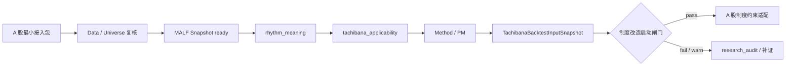

# Tachibana A 股制度改造启动闸门 v0.1

## 版本定位

- 本文件是五步攻坚计划第 5 步的启动闸门，不是 A 股制度规则定义。
- 五步攻坚总控状态见 [MALF-立花前置认知过滤器攻坚总控矩阵 v0.1](./MALF-立花前置认知过滤器攻坚总控矩阵-v0.1.md)。
- 它承接 [MALF-立花前置认知过滤器 v0.1](./MALF-立花前置认知过滤器-v0.1.md)、[MALF-立花结构状态到仓位节奏意义判定准则 v0.1](./MALF-立花结构状态到仓位节奏意义判定准则-v0.1.md)、[Tachibana A 股结构资格升级闸门检查清单 v0.1](./Tachibana-A股结构资格升级闸门检查清单-v0.1.md) 与 [Tachibana Backtest Input 适配层草案 v0.1](./Tachibana-Backtest-Input-适配层草案-v0.1.md)。
- 它只回答：什么时候允许把 A 股 T+1、涨跌停、停牌、整手、板块差异等制度约束接入 Tachibana 研究路线。
- 它不修改 MALF、Tachibana Method、Tachibana PM、Data、Signal、Backtest 的通用定义。
- 它不定义任何具体 T+1、涨跌停、停牌、撮合或仓位缩放规则。

## 总裁决

A 股制度改造只能在结构资格闭环之后启动。也就是说，制度规则不是用来回答“这只股票适不适合立花法”，而是用来回答“已经适合讨论立花节奏的样本，在 A 股制度下如何执行和回测”。



第 5 步的核心纪律：

| 纪律 | 含义 |
|---|---|
| 结构先行 | 没有可复核结构资格，不启动制度改造。 |
| Method / PM 先行 | 没有动作和仓位语义，不启动制度执行约束。 |
| 执行后置 | T+1、涨跌停、停牌只改变执行可行性，不改变结构资格。 |
| 不反写 | 制度执行失败不能反推 MALF 结构失败或 `rhythm_meaning=not_meaningful`。 |
| 不抢权 | 制度改造不生成 Signal `accept / reject / defer`。 |

## 启动条件

只有同时满足以下条件，才允许为某个 A 股样本窗口进入制度改造设计：

| Gate | 必要条件 | 证据来源 | 不满足时 |
|---|---|---|---|
| `A0` | 最小接入包 `contract_check_result=pass/warn`，且 `eligible_for_malf_run=true`。 | 最小接入包验收报告 / 复核流程 | 保持数据补证。 |
| `A1` | `malf_snapshot_ref` 存在，`snapshot_quality_status=ready`。 | MALF 快照 / 判定记录 | 不得进入前置过滤器。 |
| `A2` | `rhythm_meaning=meaningful/limited`。 | 节奏意义准则 / 判定底稿 | `not_meaningful/unknown` 进入 `research_audit`。 |
| `A3` | `tachibana_applicability=suitable/conditional`。 | 前置过滤器 / 升级闸门 | 不进入 Method / PM。 |
| `A4` | Method 动作候选与 PM 必要字段已经可解释。 | Method / PM 草案、Backtest Input | 不进入制度改造。 |
| `A5` | 已生成或可生成执行型 `TachibanaBacktestInputSnapshot`。 | Backtest Input 适配层 | 只保留研究样本。 |
| `A6` | 明确需要制度约束来解释“执行可行性”，而不是“结构是否有意义”。 | 本闸门审计记录 | 回到结构资格或 Method / PM。 |
| `A7` | `cognitive_pipeline_gate.result=pass`。 | 总控门禁 | 不得启动制度约束审计。 |

`pass/warn` 的含义：`pass` 可以进入制度改造；`warn` 只能在警告不影响 MALF 快照和结构资格时进入，并必须把警告带入制度改造审计记录。

`cognitive_pipeline_gate=pass` 只表示可以开始制度约束审计；它不表示 T+1、涨跌停、停牌等规则已经转正。

## 禁止启动条件

以下任一情况出现，制度改造必须停止：

| 禁止条件 | 裁决 |
|---|---|
| 缺 A 股最小接入包或 `contract_check_result=fail`。 | 不启动。 |
| 没有 ready MALF 快照。 | 不启动。 |
| `rhythm_meaning=not_meaningful/unknown`。 | 不启动。 |
| `tachibana_applicability=unsuitable/unknown`。 | 不启动。 |
| 只有行业、板块、流动性或题材热度，没有结构资格。 | 不启动。 |
| 只有制度事件，如涨跌停、停牌、T+1 约束，没有 Method / PM 计划。 | 不启动。 |
| 想用制度规则修正 MALF、过滤器、Method 或 PM 的主定义。 | 不启动。 |
| 想把制度约束直接写成买卖信号。 | 不启动。 |
| `cognitive_pipeline_gate.result=blocked`。 | 不启动，按其 `next_action` 回到数据修复、结构资格、Method / PM 或研究审计。 |

## 制度改造只允许回答的问题

制度改造启动后，只能回答执行层问题：

| 允许问题 | 不允许问题 |
|---|---|
| 计划动作在 A 股制度下是否可成交。 | 这个结构是否适合立花法。 |
| 计划退出是否被制度约束延后。 | 应不应该交易。 |
| 计划仓位是否因执行风险需要 PM 折扣。 | MALF wave 是否应该改写。 |
| 回测如何记录计划成交与实际成交差异。 | Signal 是否应该 `accept / reject / defer`。 |
| 制度约束如何作为 `execution_constraints_ref` 被 Backtest Input 引用。 | 用涨跌停或 T+1 直接筛选结构资格。 |

## 输出边界

制度改造启动后的第一类输出应是约束快照或执行审计，不是交易规则：

| 输出 | 允许字段 | 禁止字段 |
|---|---|---|
| `AShareExecutionConstraintSnapshot` | `constraint_ref / ts_code / trade_date / constraint_type / affected_execution_event / evidence_ref` | `buy_signal / sell_signal / trade_accept / target_position` |
| `AShareExecutionFeasibilityAudit` | `planned_event / executable_status / blocked_reason / carry_forward_required / audit_note` | `structure_suitable / rhythm_meaning / tachibana_applicability` 的改写 |
| `Backtest execution_constraints_ref` | 引用制度约束快照。 | 在 Backtest Input 内直接写制度策略。 |

v0.1 暂不展开这些快照的具体字段枚举。字段枚举必须等真实 A 股样本通过本闸门后，再按样本问题反推最小必要字段。

## 与现有 A 股适配草案的关系

[Tachibana A-Share Adaptation v0 定义草案](./Tachibana-A股适配版-雏形.md) 中已有 T+1、涨跌停、停牌、板块差异等候选约束描述。自本闸门建立后，这些内容的状态统一调整为：

| 既有内容 | 当前状态 | 转正条件 |
|---|---|---|
| T+1 候选约束 | 候选执行约束。 | 有通过本闸门的样本，且 Method / PM 计划被 T+1 具体影响。 |
| 涨跌停候选约束 | 候选执行约束。 | 有通过本闸门的样本，且计划成交或退出受涨跌停具体影响。 |
| 停牌/复牌候选约束 | 候选执行约束。 | 有通过本闸门的样本，且日线连续性和执行可行性被停牌具体影响。 |
| 板块差异候选约束 | 候选分层约束。 | 有通过本闸门的样本，且板块差异影响执行风险或 PM 尺度。 |
| 申万行业候选层 | 样本分类/分层工具。 | 不能单独转正为结构资格或交易规则。 |

换句话说，既有 A 股适配草案不是废弃，而是冻结为候选池；本闸门决定哪些候选项可以转成正式执行约束。

## 闸门审计记录模板

```yaml
ashare_institution_gate_id: ASHARE-INST-GATE-TBD-v0.1
ashare_sample_id: ASHARE-TBD
qualification_record_ref: ASHARE-QUAL-TBD
backtest_input_ref: null
gate_status: fail

contract_check_result: fail
eligible_for_malf_run: false
malf_snapshot_ref: null
snapshot_quality_status: source_missing
rhythm_meaning: unknown
tachibana_applicability: unknown
method_pm_ready: false
backtest_input_ready: false

institution_adaptation_allowed: false
allowed_constraint_scope: []
blocked_reason:
  - no_ready_malf_snapshot
  - rhythm_meaning_unknown
next_action: repair_data
```

## 当前裁决

- 当前正式数据目录尚无真实 A 股接入包，因此 A 股制度改造不能正式启动。
- 当前 `ASHARE-PENDING-001/002/003` 均不得进入制度改造。
- 下一步仍应优先补齐真实 A 股最小接入包、生成 ready MALF 快照、填写结构资格判定记录，再由本闸门决定是否启动制度约束适配。
- 任何制度规则文档在通过本闸门前，只能是候选草案，不得升级为正式方法定义。
