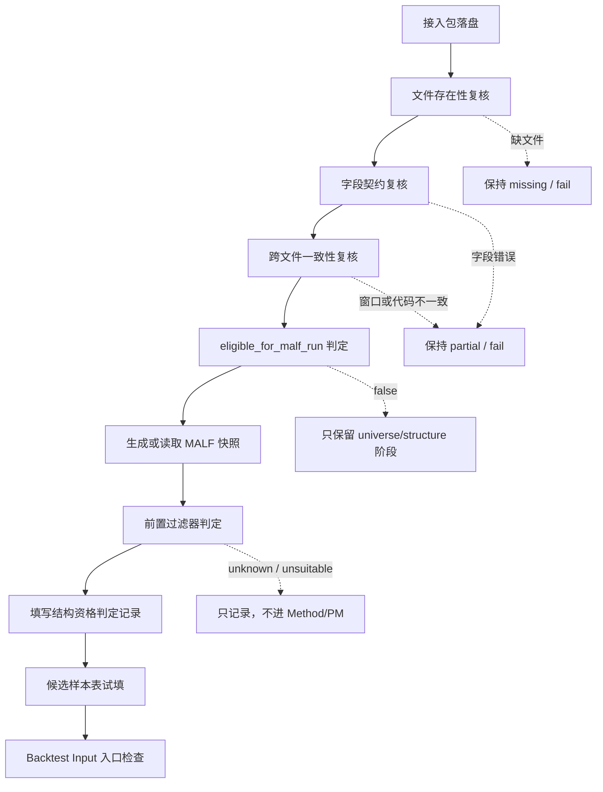

# Tachibana A 股最小接入包复核流程 v0.1

## 版本定位

- 本文件承接 [Tachibana A 股最小接入包字段契约 v0.1](./Tachibana-A股最小接入包字段契约-v0.1.md)、[Tachibana A 股最小接入包验收报告 v0.1](./Tachibana-A股最小接入包验收报告-v0.1.md) 与 [Tachibana A 股候选股票结构资格样本表 v0.1](./Tachibana-A股候选股票结构资格样本表-v0.1.md)。
- 它不是新的字段契约，不下载数据，不生成交易信号，不定义 A 股制度规则。
- 它只回答：当第一批 A 股候选数据放入正式数据目录后，怎样按固定顺序复核、生成 MALF 快照，并决定能否填入结构资格样本表。
- 本流程的目标是把 `contract_check_result=fail` 推进到 `warn/pass`；不是把股票直接推进到 `tachibana_candidate`。
- 真实数据落盘前后的操作清单见 [Tachibana A 股最小接入包落盘准备清单 v0.1](./Tachibana-A股最小接入包落盘准备清单-v0.1.md)。
- 单只股票、单个窗口的判定底稿见 [Tachibana A 股结构资格判定记录模板 v0.1](./Tachibana-A股结构资格判定记录模板-v0.1.md)。
- 阶段升级检查见 [Tachibana A 股结构资格升级闸门检查清单 v0.1](./Tachibana-A股结构资格升级闸门检查清单-v0.1.md)。

## 输入与输出

| 类别 | 内容 |
|---|---|
| 输入目录 | `Z:\asteria-trading-labs-data\ashare\` |
| 输入文件 | `candidate-universe-v0.1.csv`、`sw-industry-membership-v0.1.csv`、`daily-window-v0.1\<ts_code>.csv`、`malf-snapshots-v0.1\<ts_code>-<window>.json` |
| 中间输出 | 更新后的接入包验收报告、失败项清单、可运行 MALF 的候选窗口清单、结构资格判定记录 |
| 最终输出 | 可填入 [Tachibana A 股候选股票结构资格样本表 v0.1](./Tachibana-A股候选股票结构资格样本表-v0.1.md) 的 `universe_candidate / structure_candidate / tachibana_candidate` 记录 |

## 机器复核入口

在仓库根目录运行只读验收器：

```powershell
$env:PYTHONPATH='src'; python -m ashare_intake_validator --root Z:\asteria-trading-labs-data
```

该命令只读取 `Z:\asteria-trading-labs-data\ashare\`，不下载数据、不生成快照、不写入正式数据目录。它输出 `intake_package_status`、`contract_check_result`、`eligible_for_malf_run`、`eligible_for_structure_candidate`、`eligible_for_tachibana_candidate`、`candidate_stage_summary`、`stage_reason_consistency` 与 `failed_contract_items`，作为 Step 1 至 Step 3 的第一轮机器复核证据。

其中 `failed_contract_items` 保留精确机器错误，例如路径、字段、文件名和行号；`failed_contract_reason_codes` 是按 [Tachibana A 股结构资格理由码表 v0.1](./Tachibana-A股结构资格理由码表-v0.1.md) 归一后的受控理由码，用于填写结构资格判定底稿。

注意：机器接入包验收器的 `eligible_for_tachibana_candidate` 在前置过滤器运行前固定为 `false`。接入包 `pass` 只能证明可进入 `eligible_for_malf_run / eligible_for_structure_candidate`，不能证明适合立花法。

仓库内提供一个非真实最小接入包 fixture，可用于自检机器闸门链：

```powershell
$env:PYTHONPATH='src'; python -m ashare_intake_validator --root tests\fixtures\ashare-intake-ready
```

该 fixture 只证明 `contract_check_result=pass` 时，候选最多升级为 `candidate_stage_after=structure_candidate`，顶层 `eligible_for_tachibana_candidate=false`，`tachibana_applicability` 仍为 `unknown`，下一步必须是 `action:run_front_filter`。它不是正式 A 股数据，不得复制到 `Z:\asteria-trading-labs-data` 作为市场证据。

前置过滤器的只读运行入口如下：

```powershell
$env:PYTHONPATH='src'; python -m tachibana_front_filter --snapshot tests\fixtures\front-filter\alive-wave-ready.json
```

该命令只读取单个 MALF snapshot，并输出 `rhythm_meaning`、`tachibana_applicability`、`qualification_rule_id`、`rule_match_reason`、`applicability_reason`、`boundary_warning` 与 `next_action`。它不写回 MALF、不生成买卖信号、不生成目标仓位，也不处理 T+1、涨跌停或停牌制度约束。

如果需要把前置过滤器结果转成判定底稿草案，可使用：

```powershell
$env:PYTHONPATH='src'; python -m tachibana_front_filter --snapshot tests\fixtures\front-filter\alive-wave-ready.json --record-draft --ashare-sample-id ASHARE-FIXTURE-001 --symbol-name "Ping An Bank"
```

该草案只承接 [Tachibana A 股结构资格判定记录模板 v0.1](./Tachibana-A股结构资格判定记录模板-v0.1.md) 的结构资格字段，如 `qualification_record_id`、`candidate_stage_after`、`rhythm_meaning`、`tachibana_applicability`、`qualification_rule_id`、`meaning_reason`、`boundary_warning`、`evidence_level` 与 `next_action`。它不写文件、不更新候选样本表、不生成 Method / PM 动作，也不生成交易或仓位字段。真实样本必须先人工复核草案，再决定是否更新 [Tachibana A 股候选股票结构资格样本表 v0.1](./Tachibana-A股候选股票结构资格样本表-v0.1.md)。

判定底稿草案会附带 `record_consistency` 内部一致性审计。该审计只检查草案自洽性，不替代结构判断本身。它会阻断以下问题：

| 审计问题 | 示例 |
|---|---|
| 阶段越级 | `rhythm_meaning=unknown` 却写成 `candidate_stage_after=tachibana_candidate`。 |
| 映射矛盾 | `tachibana_applicability=suitable` 但 `rhythm_meaning` 不是 `meaningful`。 |
| 反例误升级 | `rhythm_meaning=not_meaningful` 却给 `action:fill_candidate_table`。 |
| 缺规则编号 | `tachibana_candidate` 没有 `qualification_rule_id`。 |
| 交易字段污染 | 草案中出现 `buy_signal / trade_accept / target_position / ashare_t1_action`。 |

判定底稿草案还会附带 `candidate_table_gate` 候选样本表更新门禁。该门禁只回答“这条草案是否允许写入候选样本表的 `tachibana_candidate` 阶段”，不产生新的结构判断。只有同时满足以下条件时，`candidate_table_gate.result=pass`：

| 门禁条件 | 含义 |
|---|---|
| `record_consistency.result=pass` | 判定底稿内部没有阶段、意义、适用性或禁止字段矛盾。 |
| `candidate_stage_after=tachibana_candidate` | 只允许真正通过前置过滤器的记录写入候选样本表。 |
| `rhythm_meaning=meaningful/limited` | 仓位节奏有意义或有限意义。 |
| `tachibana_applicability=suitable/conditional` | 可以进入 Method / PM 讨论，或受限进入。 |
| `qualification_rule_id` 非空且不是 `NM-*` | 必须有正向或受限资格规则，反例规则不得升级。 |
| `boundary_warning` 非空 | 必须携带边界警告，防止 Method / PM 误读。 |
| `evidence_level` 包含 `E1_malf_snapshot` | 必须能追溯到 MALF 快照证据。 |
| 无交易/仓位/制度字段 | 不得出现 `buy_signal / trade_accept / target_position / ashare_t1_action`。 |

如果 `candidate_table_gate.result=blocked`，该记录只能保持待复核、研究备注或 `research_audit_only`，不得人工绕过写成 `tachibana_candidate`。

当前最小机器规则覆盖：

| MALF snapshot 条件 | 输出 |
|---|---|
| `malf_background=alive_wave` 且 `wave_core_state=alive` | `rhythm_meaning=meaningful`、`tachibana_applicability=suitable`、`qualification_rule_id=Q-ALIVE-CLEAN`。 |
| `malf_background=break_birth` 且 `birth_type=seed_after_clear` | `rhythm_meaning=limited`、`tachibana_applicability=conditional`、`qualification_rule_id=Q-SEED-AFTER-CLEAR`。 |
| `malf_background=pullback` 且 `pressure_adjustment=true` | `rhythm_meaning=limited`、`tachibana_applicability=conditional`、`qualification_rule_id=Q-PRESSURE-ADJUST`。 |
| `malf_background=range` 且 `no_trade_wait=true` | `rhythm_meaning=limited`、`tachibana_applicability=conditional`、`qualification_rule_id=Q-LOCK-WAIT`，并警告无交易不能反推 range。 |
| `malf_background=stagnation` 且 `clear_reset=true` | `rhythm_meaning=limited`、`tachibana_applicability=conditional`、`qualification_rule_id=Q-CLEAR-RESET`。 |
| `wave_range_break_fields.source_disrupted=true` | 保持 `structure_candidate`，输出 `rhythm_meaning=unknown`、`tachibana_applicability=unknown`、`qualification_rule_id=Q-SOURCE-DISRUPTED`。 |
| `negative_type=NM-NO-STRUCTURE` | 输出 `rhythm_meaning=not_meaningful`、`tachibana_applicability=unsuitable`，只进入 `research_audit`。 |
| `malf_background=unknown` 或快照未 ready | 保持 `structure_candidate`，输出 `rhythm_meaning=unknown`、`tachibana_applicability=unknown`。 |

退出码含义：

| 退出码 | 含义 |
|---|---|
| `0` | `contract_check_result=pass`，可继续人工复核跨文件一致性与 MALF 快照。 |
| `1` | `contract_check_result=fail/warn`，不得升级真实结构资格样本。 |

## 复核总流程



## Step 1. 文件存在性复核

| 检查项 | 通过条件 | 失败处理 |
|---|---|---|
| `candidate-universe-v0.1.csv` | 文件存在且可读取。 | `intake_package_status=missing` 或 `partial`，不能生成真实 `universe_candidate`。 |
| `sw-industry-membership-v0.1.csv` | 文件存在且可读取。 | 不能升级到 `structure_candidate`。 |
| `daily-window-v0.1\` | 目录存在，且至少有一个 `<ts_code>.csv`。 | `eligible_for_malf_run=false`。 |
| `malf-snapshots-v0.1\` | 目录存在，或明确进入待生成队列。 | 不能生成 `tachibana_candidate`。 |

文件存在性只决定能否进入下一步复核，不代表字段内容通过。

## Step 2. 字段契约复核

| 文件 | 必须复核 | 失败处理 |
|---|---|---|
| `candidate-universe-v0.1.csv` | 表头、`ts_code` 非空唯一、`board_type/list_date/is_st/is_new_stock_window/source_ref` 完整。 | 对应股票保持 `unknown` 或 `blocked_by_missing_metadata`。 |
| `sw-industry-membership-v0.1.csv` | `ts_code + valid_from` 主键、`valid_from/valid_to` 时间合法、`source_ref` 可追溯。 | 对应股票不得升级为 `structure_candidate`。 |
| `daily-window-v0.1\<ts_code>.csv` | `ts_code` 与文件名一致、日期升序、OHLC 合法、成交量/成交额非负、质量标记存在。 | 对应窗口不得进入 MALF。 |
| `malf-snapshots-v0.1\<ts_code>-<window>.json` | `ts_code` 与文件名一致、窗口落在日线范围内、`snapshot_quality_status` 合法。 | 对应窗口不得升级为 `tachibana_candidate`。 |

字段契约复核输出：

| 输出字段 | 含义 |
|---|---|
| `contract_check_result=pass` | 所有必需字段与跨文件一致性通过，可进入候选样本试填。 |
| `contract_check_result=warn` | 存在非阻断问题，可进入样本试填但必须携带 `boundary_warning` 或 `data_quality_warning`。 |
| `contract_check_result=fail` | 存在阻断问题，不得进入真实结构资格样本。 |
| `failed_contract_items` | 精确机器失败项，保留到文件、字段或行号。 |
| `failed_contract_reason_codes` | 归一化结构资格理由码，不携带路径细节。 |

## Step 3. 跨文件一致性复核

| 复核关系 | 要求 | 失败后果 |
|---|---|---|
| 元数据与行业标签 | `sw-industry-membership-v0.1.csv` 中的 `ts_code` 必须能在候选元数据中找到。 | 行业标签孤儿记录，不进入候选样本表。 |
| 元数据与日线窗口 | `daily-window-v0.1\<ts_code>.csv` 必须能对应候选元数据。 | 日线孤儿记录，不进入 MALF。 |
| 行业标签与样本窗口 | 样本窗口内必须有有效申万标签。 | 保持 `universe_candidate`，不能升级。 |
| 日线窗口与 MALF 快照 | 快照窗口必须落在日线窗口内。 | 快照作废或保持 `snapshot_quality_status=disputed`。 |
| MALF 快照与候选表 | `malf_snapshot_ref` 必须能追溯到 JSON 文件。 | 不能填 `tachibana_candidate`。 |

只读验收器当前已覆盖以下机器可判定项：

| 机器检查项 | 失败项示例 |
|---|---|
| 主键非空且唯一。 | `missing_key:<file>:<key>`、`duplicate_key:<file>:<key>:<value>` |
| 枚举字段必须在契约允许值内。 | `invalid_enum:<file>:<field>:<value>` |
| 日期字段必须使用 `YYYY-MM-DD`。 | `invalid_date:<file>:<field>:<value>` |
| 布尔字段必须为 `true / false`。 | `invalid_boolean:<file>:<field>:<value>` |
| 价格、成交量、成交额不得为负。 | `negative_number:<file>:<field>:line_<n>` |
| 行业标签 `ts_code` 必须存在于候选元数据。 | `orphan_sw_ts_code:<ts_code>` |
| 日线文件 `<ts_code>.csv` 必须存在于候选元数据。 | `orphan_daily_ts_code:<ts_code>` |
| 日线文件名与文件内 `ts_code` 必须一致。 | `daily_filename_ts_code_mismatch:<file>:<ts_code>` |
| 快照 `source_daily_file` 必须能追溯到日线文件。 | `snapshot_source_daily_missing:<snapshot>:<source_daily_file>` |
| 快照 `window_start/window_end` 必须落在日线日期范围内。 | `snapshot_window_outside_daily_range:<snapshot>` |

申万标签是否覆盖具体样本窗口、`malf_background` 是否可支持 `tachibana_applicability`，仍需进入后续结构判定底稿，不在接入包验收器里裁决。

`candidate_stage_summary` 是按 `ts_code` 生成的阶段摘要：

| 字段 | 含义 |
|---|---|
| `candidate_stage_after` | 当前机器复核后可停留的最高阶段。 |
| `eligible_for_malf_run` | 行业标签与日线窗口是否足以进入 MALF 运行准备。 |
| `tachibana_applicability` | 固定为 `unknown`，必须由前置过滤器另行裁决。 |
| `failed_contract_reason_codes` | 来自理由码表的接入包缺失或失败码。 |
| `rule_match_reason` | 来自理由码表的阶段阻断码。 |
| `applicability_reason` | 来自理由码表的 `tachibana_applicability=unknown` 原因。 |
| `boundary_warning` | 来自理由码表的不可跳级边界警告。 |
| `blocking_reasons` | 兼容字段，汇总上述阻断与边界码。 |
| `next_action` | 来自理由码表的 `action:*` 下一步动作。 |

注意：即使 `snapshot_quality_status=ready`，阶段摘要也最多给出 `candidate_stage_after=structure_candidate` 与 `next_action=action:run_front_filter`；不得把 ready 快照直接升级为 `tachibana_candidate`。

`stage_reason_consistency` 是报告内部一致性审计：

| 字段 | 含义 |
|---|---|
| `result` | `pass / fail`，只表示阶段摘要和理由码之间是否自洽。 |
| `issues` | 内部矛盾列表，如阶段越级、适用性提前裁决、`next_action` 未使用 `action:*`。 |

该审计不判断结构是否适合立花法，只防止接入包报告内部自相矛盾。

## Step 4. eligible_for_malf_run 判定

`eligible_for_malf_run=true` 的最低条件：

| 条件 | 说明 |
|---|---|
| 元数据可识别 | `candidate-universe-v0.1.csv` 中有唯一 `ts_code`。 |
| 日线窗口可读取 | `daily-window-v0.1\<ts_code>.csv` 字段完整且 OHLC 合法。 |
| 观察窗口明确 | 能确定 `sample_window_start / sample_window_end`。 |
| 质量风险可标记 | 停牌、公司行为、缺 bar 等问题已用数据质量字段标出。 |

`eligible_for_malf_run=true` 只表示“可以生成 MALF 快照”，不表示“适合立花法”，也不表示“可以交易”。

## Step 5. MALF 快照复核

| 快照状态 | 处理 |
|---|---|
| `snapshot_quality_status=ready` | 可进入前置过滤器，但仍需判断 `tachibana_applicability`。 |
| `snapshot_quality_status=incomplete` | 保留为补证对象，不进入 `tachibana_candidate`。 |
| `snapshot_quality_status=source_missing` | 回到数据接入修复。 |
| `snapshot_quality_status=disputed` | 需要列出争议来源，不进入 Method / PM。 |

`malf_background=unknown` 时不得人工改写为 `suitable / conditional`。如果快照质量为 `ready` 但结构背景仍是 `unknown`，候选样本表应保留 `tachibana_applicability=unknown`。

## Step 6. 前置过滤器判定

| `tachibana_applicability` | 样本表处理 | 是否进入 Method / PM |
|---|---|---|
| `suitable` | 可填 `tachibana_candidate`，必须携带 `qualification_rule_id` 与证据。 | 可以。 |
| `conditional` | 可填 `tachibana_candidate`，必须携带 `boundary_warning`。 | 可以，但受限。 |
| `unsuitable` | 记录为 `rejected` 或研究备注。 | 不可以。 |
| `unknown` | 保持 `structure_candidate` 或 `unknown`。 | 不可以。 |

前置过滤器只判断“是否值得进入 Tachibana Method / PM 讨论”，不输出买卖动作、目标仓位或回测成交事件。

## Step 7. 候选样本表更新

候选样本表更新前，必须先填写 [Tachibana A 股结构资格判定记录模板 v0.1](./Tachibana-A股结构资格判定记录模板-v0.1.md)。样本表只吸收判定记录中的最终汇总字段，不替代底稿。

机器草案进入候选样本表前，必须同时满足：

| 检查 | 要求 |
|---|---|
| `record_consistency` | `result=pass`。 |
| `candidate_table_gate` | `result=pass`。 |
| `candidate_table_gate.next_action` | `action:fill_candidate_table`。 |

`record_consistency=pass` 只说明底稿内部自洽；是否允许写入 `tachibana_candidate`，以 `candidate_table_gate=pass` 为准。

| 目标阶段 | 可以写入的字段 | 禁止写入 |
|---|---|---|
| `universe_candidate` | `ts_code/symbol_name/board_type/list_date/is_st/is_new_stock_window/source_ref`。 | `malf_background/tachibana_applicability/buy_signal`。 |
| `structure_candidate` | 日线窗口、申万标签、`eligible_for_malf_run`、数据质量警告。 | `target_position/trade_accept/ashare_t1_action`。 |
| `tachibana_candidate` | `malf_snapshot_ref/malf_background/qualification_rule_id/tachibana_applicability/boundary_warning/evidence_level`。 | 任何交易执行、仓位手数或制度策略字段。 |

只有 `tachibana_candidate` 才允许进入 [Tachibana Backtest Input 适配层草案 v0.1](./Tachibana-Backtest-Input-适配层草案-v0.1.md)。`universe_candidate` 与 `structure_candidate` 不得绕过前置过滤器进入 Method / PM。

## 阻断清单

| 阻断条件 | 必须停在哪一层 |
|---|---|
| 缺 `candidate-universe-v0.1.csv` | 数据接入审计。 |
| 缺申万标签 | `universe_candidate`。 |
| 缺日线窗口 | `universe_candidate` 或 `unknown`。 |
| 日线窗口字段不合法 | `structure_candidate` 之前。 |
| 缺 MALF 快照 | `structure_candidate`。 |
| MALF 快照 `incomplete/source_missing/disputed` | `structure_candidate` 或研究备注。 |
| 前置过滤器输出 `unknown/unsuitable` | 不进入 Method / PM。 |

## 禁止提前进入的工作

| 禁止工作 | 原因 |
|---|---|
| T+1 交易适配 | 执行约束后置，不属于结构资格复核。 |
| 涨跌停策略 | 制度执行后置，不属于 MALF 快照。 |
| 停牌处理策略 | 当前只允许作为数据质量标记。 |
| 行业热度打分 | 行业标签只是样本分层事实。 |
| 目标仓位生成 | 仓位属于 PM，必须在前置过滤器通过后才讨论。 |
| 买卖信号生成 | 结构资格不是 Signal 裁决。 |

## 当前执行状态

- 当前正式数据目录仍无可验收 A 股文件，见 [Tachibana A 股最小接入包验收报告 v0.1](./Tachibana-A股最小接入包验收报告-v0.1.md)。
- 因此本流程当前只能作为下一轮数据接入后的复核顺序，不能生成真实 A 股结构资格样本。
- 下一步仍是先按 [Tachibana A 股最小接入包落盘准备清单 v0.1](./Tachibana-A股最小接入包落盘准备清单-v0.1.md) 补齐最小接入包，再按本流程复核，填写结构资格判定记录，并按 [Tachibana A 股结构资格升级闸门检查清单 v0.1](./Tachibana-A股结构资格升级闸门检查清单-v0.1.md) 审核阶段升级，再运行 MALF 快照和更新候选样本表；制度规则改造继续后置。
