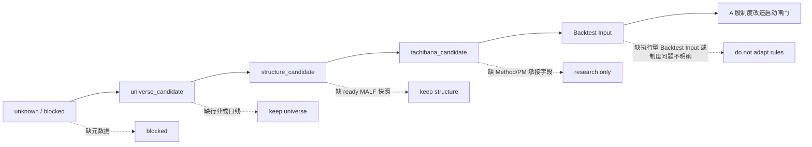

# Tachibana A 股结构资格升级闸门检查清单 v0.1

## 版本定位

- 本文件承接 [Tachibana A 股候选股票结构资格样本表 v0.1](./Tachibana-A股候选股票结构资格样本表-v0.1.md)、[Tachibana A 股结构资格判定记录模板 v0.1](./Tachibana-A股结构资格判定记录模板-v0.1.md) 与 [Tachibana A 股最小接入包复核流程 v0.1](./Tachibana-A股最小接入包复核流程-v0.1.md)。
- 它是结构资格升级的审计清单，不是新的选股公式，不是交易信号，不是 A 股制度规则。
- 它只回答：一个 A 股候选窗口能否从 `unknown` 逐级升级到 `universe_candidate / structure_candidate / tachibana_candidate / Backtest Input`。
- 本文件不定义 T+1、涨跌停、停牌、整手、融资融券或任何执行约束。
- 阻断理由、边界警告和下一步动作的受控词表见 [Tachibana A 股结构资格理由码表 v0.1](./Tachibana-A股结构资格理由码表-v0.1.md)。
- 通过 `Backtest Input` 后，是否允许启动 A 股制度约束改造，另见 [Tachibana A 股制度改造启动闸门 v0.1](./Tachibana-A股制度改造启动闸门-v0.1.md)。

## 总原则

| 原则 | 含义 |
|---|---|
| 禁止跳级 | 每个阶段只能从上一阶段升级，不能从元数据或行业标签直接跳到 `tachibana_candidate`。 |
| 证据先行 | 每次升级都必须有判定记录底稿，不得只在汇总样本表里改字段。 |
| MALF 必经 | 没有 `snapshot_quality_status=ready` 的 MALF 快照，不得进入前置过滤器。 |
| 前置过滤器必经 | 没有 `tachibana_applicability=suitable/conditional`，不得进入 Method / PM。 |
| 执行规则后置 | T+1、涨跌停、停牌等制度约束不得反向影响结构资格升级。 |

## 升级路径

## Gate 0. unknown / blocked -> universe_candidate

| 检查项 | 必须满足 | 阻断处理 |
|---|---|---|
| `candidate-universe-v0.1.csv` | 文件存在且可读取。 | 保持 `unknown` 或 `blocked_by_missing_metadata`。 |
| `ts_code` | 非空、唯一。 | 不得生成真实 `ashare_sample_id`。 |
| `symbol_name` | 非空。 | 保持 `unknown`。 |
| `board_type` | `main / gem / star / bse / unknown` 之一。 | 可保留为 `unknown`，但不得升级为 `structure_candidate`。 |
| `list_date` | 可追溯。 | 保持 `unknown` 或 `universe_candidate` 待补。 |
| `is_st` | `true / false`。 | 保持 `unknown` 或待补。 |
| `is_new_stock_window` | `true / false`。 | 保持 `unknown` 或待补。 |
| `source_ref` | 非空。 | 保持 `unknown`。 |

通过后允许写入：

| 字段 | 允许 |
|---|---|
| `candidate_stage` | `universe_candidate` |
| `tachibana_applicability` | `unknown` |
| `malf_snapshot_ref` | `null` |
| `next_action` | `complete_industry_and_daily_window` |

禁止：仅凭板块、ST、新股窗口或人工选择升级为 `structure_candidate`。

## Gate 1. universe_candidate -> structure_candidate

| 检查项 | 必须满足 | 阻断处理 |
|---|---|---|
| 申万行业标签 | 观察窗口内有有效 `sw_l1_name`，可追溯 `source_ref`。 | 保持 `universe_candidate`。 |
| 日线窗口 | `daily-window-v0.1\<ts_code>.csv` 存在且可读取。 | 保持 `universe_candidate`。 |
| OHLC 合法性 | 正常交易行满足 OHLC 基本关系。 | 保持 `universe_candidate` 或 `unknown`。 |
| 时间窗口 | `sample_window_start / sample_window_end` 明确。 | 保持 `universe_candidate`。 |
| 数据质量标记 | 停牌、公司行为、缺 bar 可标记。 | 可 `warn`，但必须携带 `data_quality_warning`。 |
| `eligible_for_malf_run` | `true`。 | 不得升级。 |

通过后允许写入：

| 字段 | 允许 |
|---|---|
| `candidate_stage` | `structure_candidate` |
| `tachibana_applicability` | `unknown` |
| `malf_snapshot_ref` | `null` 或待生成引用 |
| `next_action` | `run_malf_snapshot` |

禁止：仅凭行业标签、流动性、成交额、波动率或题材热度升级为 `tachibana_candidate`。

## Gate 2. structure_candidate -> tachibana_candidate

| 检查项 | 必须满足 | 阻断处理 |
|---|---|---|
| MALF 快照 | 有 `malf_snapshot_ref`。 | 保持 `structure_candidate`。 |
| 快照质量 | `snapshot_quality_status=ready`。 | 保持 `structure_candidate` 或研究备注。 |
| MALF 背景 | `malf_background` 不只是人工臆测。 | 保持 `unknown`。 |
| 横向矩阵 | 有 `qualification_rule_id` 或明确阻断原因。 | 无规则时保持 `structure_candidate`。 |
| 边界警告 | 复杂结构必须携带 `boundary_warning`。 | 保持 `structure_candidate` 或 `conditional` 待补。 |
| 前置过滤器 | `tachibana_applicability=suitable/conditional`。 | `unknown/unsuitable` 不升级。 |
| 判定底稿 | 已填写结构资格判定记录。 | 不得更新候选样本表为 `tachibana_candidate`。 |
| 底稿一致性 | `record_consistency.result=pass`。 | 回到判定底稿修正。 |
| 样本表门禁 | `candidate_table_gate.result=pass` 且 `next_action=action:fill_candidate_table`。 | 不得写入候选样本表的 `tachibana_candidate` 阶段。 |

通过后允许写入：

| 字段 | 允许 |
|---|---|
| `candidate_stage` | `tachibana_candidate` |
| `tachibana_applicability` | `suitable / conditional` |
| `qualification_rule_id` | 横向矩阵规则 |
| `boundary_warning` | 必填 |
| `next_action` | `method_pm_review` |

禁止：把 `eligible_for_malf_run=true`、`contract_check_result=pass` 或 `snapshot_quality_status=ready` 单独当作 `tachibana_candidate` 资格。

补充：`candidate_table_gate` 只控制样本表更新，不替代前置过滤器。若它输出 `blocked`，即使 `record_consistency=pass`，也只能保留待复核、研究备注或 `research_audit_only`。

## Gate 3. tachibana_candidate -> Backtest Input

| 检查项 | 必须满足 | 阻断处理 |
|---|---|---|
| `tachibana_applicability` | `suitable / conditional`。 | 不进入 Backtest Input。 |
| `qualification_rule_id` | 非空。 | 保留在研究样本。 |
| `boundary_warning` | 非空；`conditional` 必须携带。 | 保留在研究样本。 |
| `evidence_level` | 至少有 `E1_malf_snapshot` 与必要 Data 证据。 | 保留在研究样本。 |
| Method / PM 承接 | Method 动作候选与 PM 必要字段可解释。 | 保留在研究样本。 |
| Backtest Input 门禁 | `backtest_input_gate.result=pass`。 | 输出 `action:method_pm_review`，不得生成执行型回测输入。 |
| 禁止字段检查 | 无 `buy_signal / trade_accept / target_position / ashare_t1_action`。 | 退回清洗。 |

通过后允许进入 [Tachibana Backtest Input 适配层草案 v0.1](./Tachibana-Backtest-Input-适配层草案-v0.1.md)。

禁止：把 Backtest Input 当成通用 Signal，或把 `tachibana_applicability=suitable` 改写成 `accept`。

补充：Gate 2 通过只说明可以写入 `tachibana_candidate`；Gate 3 通过才说明 Method / PM 与执行意图足以生成 `TachibanaBacktestInputSnapshot`。缺 Method / PM 计划时，即使 `candidate_table_gate=pass`，也只能停在 `action:method_pm_review`。

## Gate 4. Backtest Input -> A 股制度改造启动闸门

| 检查项 | 必须满足 | 阻断处理 |
|---|---|---|
| 执行型 Backtest Input | 已有或可生成 `TachibanaBacktestInputSnapshot`，且不是 `research_audit`。 | 不启动制度改造。 |
| `rhythm_meaning` | `meaningful / limited`。 | `not_meaningful / unknown` 只保留研究审计。 |
| `tachibana_applicability` | `suitable / conditional`。 | 不启动制度改造。 |
| Method / PM 计划 | 有计划动作、仓位语义或至少明确的动作候选。 | 回到 Method / PM。 |
| 制度问题明确 | 能说明某个制度约束影响执行可行性，而不是影响结构资格。 | 回到结构资格或 Method / PM。 |
| 禁止字段检查 | 无 `buy_signal / trade_accept / target_position / ashare_t1_action`。 | 退回清洗。 |

通过后只允许进入 [Tachibana A 股制度改造启动闸门 v0.1](./Tachibana-A股制度改造启动闸门-v0.1.md)，由该闸门决定是否把候选制度约束转为正式执行约束。

禁止：因为某个样本遇到 T+1、涨跌停、停牌，就反向改写 `rhythm_meaning`、`tachibana_applicability` 或 MALF 背景。

## 降级与回退

| 触发 | 回退目标 | 说明 |
|---|---|---|
| 元数据来源失效 | `unknown` | `universe_candidate` 不再成立。 |
| 行业标签窗口不覆盖 | `universe_candidate` | 不能继续保持 `structure_candidate`。 |
| 日线窗口被判 `disputed` | `universe_candidate` 或 `unknown` | 视争议是否影响样本窗口。 |
| MALF 快照从 `ready` 改为 `disputed` | `structure_candidate` | 不能继续保持 `tachibana_candidate`。 |
| 前置过滤器从 `conditional` 改为 `unknown` | `structure_candidate` | 不进入 Method / PM。 |
| 发现禁止字段污染 | 退回上一阶段 | 必须清除交易裁决、目标仓位或制度策略字段。 |

## Pending 队列当前检查

| sample_id | 当前底稿 | 当前 Gate | 阻断原因 | 裁决 |
|---|---|---|---|---|
| `ASHARE-PENDING-001` | [ASHARE-PENDING 阻断态底稿](./Tachibana-A股结构资格判定记录-ASHARE-PENDING-v0.1.md) | Gate 0 | 缺元数据、行业、日线、MALF 快照。 | 不得升级。 |
| `ASHARE-PENDING-002` | [ASHARE-PENDING 阻断态底稿](./Tachibana-A股结构资格判定记录-ASHARE-PENDING-v0.1.md) | Gate 1 / Gate 2 | 缺日线窗口与 MALF 快照。 | 不得升级。 |
| `ASHARE-PENDING-003` | [ASHARE-PENDING 阻断态底稿](./Tachibana-A股结构资格判定记录-ASHARE-PENDING-v0.1.md) | Gate 0 | 缺 board、ST、新股窗口、行业标签。 | 不得升级。 |

## 禁止跳级表

| 跳级写法 | 裁决 |
|---|---|
| `board_type=main` -> `tachibana_candidate` | 禁止。板块不是结构资格。 |
| `sw_l1_name` 已知 -> `tachibana_candidate` | 禁止。行业不是结构资格。 |
| 成交额足够 -> `tachibana_candidate` | 禁止。流动性不是结构资格。 |
| `contract_check_result=pass` -> `tachibana_candidate` | 禁止。字段通过不等于结构适用。 |
| `eligible_for_malf_run=true` -> Method / PM | 禁止。可运行 MALF 不等于值得讨论。 |
| `snapshot_quality_status=ready` -> Method / PM | 禁止。还需要前置过滤器。 |
| `tachibana_applicability=suitable` -> `trade_accept` | 禁止。结构资格不是 Signal 裁决。 |
| `Backtest Input` -> `A 股制度规则正式生效` | 禁止。还必须通过制度改造启动闸门。 |

## 当前结论

- A 股结构资格必须逐级通过 Gate 0、Gate 1、Gate 2、Gate 3。
- 当前 `ASHARE-PENDING-001/002/003` 全部停在阻断态，不得升级。
- 升级或阻断原因应优先使用 [Tachibana A 股结构资格理由码表 v0.1](./Tachibana-A股结构资格理由码表-v0.1.md)，避免自由文本漂移。
- 本清单把“结构状态 -> 仓位节奏意义”的入口约束进一步具体化：只有 `tachibana_candidate` 才有资格进入 Method / PM；真实交易制度仍后置。
- 即使进入 Backtest Input，也只是具备申请制度改造的资格；能否启动 T+1、涨跌停、停牌等执行约束适配，必须再通过 [Tachibana A 股制度改造启动闸门 v0.1](./Tachibana-A股制度改造启动闸门-v0.1.md)。
