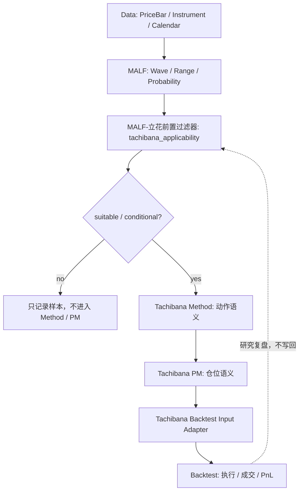

# Tachibana Data / Signal / Backtest 接口边界审计 v0.1

## 版本定位

- 本文件是五步攻坚计划第 3 步的审计产物。
- 它承接 [MALF-立花前置认知过滤器 v0.1](./MALF-立花前置认知过滤器-v0.1.md) 与 [Tachibana 分层边界审计 v0.1](./Tachibana-分层边界审计-v0.1.md)。
- `rhythm_meaning` 的 Data / Signal / Backtest 接缝见 [Tachibana rhythm_meaning Data / Signal / Backtest 接口接缝补丁 v0.1](./Tachibana-rhythm_meaning-Data-Signal-Backtest-接口接缝补丁-v0.1.md)。
- 它不修改 `Data / Signal / Backtest / System Collaboration` 的通用定义。
- 它只回答：这些通用定义能不能支撑立花法，哪里必须加 Tachibana 专用接缝，哪里不能让执行层反向绑架结构资格。

## 审计对象

| 定义源 | 当前职责 | 与立花前置过滤器的关系 |
|---|---|---|
| `Data_Definitive_v2_0` | 市场事实源头，提供 `PriceBar`、`InstrumentRecord`、Universe、交易日历。 | 可供 MALF 跑结构、供 A 股适配选股池，但不判断结构资格。 |
| `Signal_Definitive_v2_0` | 通用交易决策层，输出 `accept / reject / defer` 和 `TradeDecisionSnapshot`。 | 不能直接消费 `rhythm_meaning / tachibana_applicability` 并把它们改写为交易裁决。 |
| `Backtest_Definitive_v2_0` | 执行层，处理仓位、订单、成交、PnL、A 股撮合约束。 | 可执行 Method / PM 后的交易计划，但不能用绩效反推 MALF 或过滤器定义。 |
| `System_Collaboration_v2_0` | 全系统模块宪法，保证单向流、Snapshot、职责独占。 | 与前置过滤器不冲突；过滤器必须被定义为 Tachibana 研究接缝，不是 Signal 替代品。 |

## 总裁决

| 模块 | 是否足够通用 | 是否需要修订通用定义 | Tachibana 侧需要补什么 |
|---|---|---|---|
| `Data` | 是。 | 否。 | 只需明确 A 股候选池先用 Data 宇宙事实，再由 MALF / 前置过滤器判结构资格。 |
| `Signal` | 部分足够。 | 暂不修订。 | 需要一层 Tachibana 专用接缝，防止 `rhythm_meaning / tachibana_applicability` 被误读成 `accept / reject / defer`。 |
| `Backtest` | 执行层足够，入口偏 Signal。 | 暂不修订。 | 由 [Tachibana Backtest Input 适配层草案 v0.1](./Tachibana-Backtest-Input-适配层草案-v0.1.md) 把 Method / PM 计划转成可执行事件。 |
| `System Collaboration` | 是。 | 否。 | 只需在 Tachibana 文档中声明过滤器不是新系统模块，也不打破单向流。 |

## Data 边界审计

| Data 可做 | Data 不可做 | Tachibana 用法 |
|---|---|---|
| 提供 `qfq_back / raw_none` 双轨 `PriceBar`。 | 判断 wave、range、break。 | MALF 用 `qfq_back` 跑结构；A 股制度判定用 `raw_none`。 |
| 提供 `InstrumentRecord`、board、ST、新股、流动性过滤字段。 | 判断某只股票适不适合立花法。 | A 股候选池先过滤基础可交易性，再交给 MALF 结构资格。 |
| 提供 `trade_calendar` 与停牌/缺 bar 事实。 | 把停牌解释为等待、震荡或结构失败。 | A 股适配记录制度中断，不能改写 MALF 主定义。 |
| 提供 Universe 统计。 | 输出买卖信号、仓位建议。 | 只能作为样本分层、覆盖率和数据质量依据。 |

结论：`Data` 定义干净，能够作为通用定义支撑立花法。Tachibana 不应要求 Data 增加 `tachibana_suitable`、`method_candidate`、`position_style` 这类字段。

## Signal 边界审计

| 风险点 | 为什么危险 | 裁决 |
|---|---|---|
| 把 `tachibana_applicability = suitable` 当作 `accept`。 | 前置过滤器只判“是否值得讨论”，不是“该不该交易”。 | 永禁。 |
| 把 `rhythm_meaning = meaningful` 当作 `accept`。 | `rhythm_meaning` 只判断仓位节奏是否有讨论意义，比适用性更前置。 | 永禁。 |
| 把 `unsuitable` 当作 `reject`。 | `unsuitable` 不是看空，也不是交易失败，只是立花节奏不适用。 | 永禁。 |
| 让 Signal 直接读月报、章节、PM 标注。 | Signal 通用定义只消费 CPS / WPS 公开字段，不读研究文本。 | 永禁。 |
| 把 Method 动作候选塞进 Signal Gate 规则。 | `trend_probe_entry / reversal_flip / wait_no_action` 是 Method 语义，不是通用 Signal 规则。 | 暂不进入 Signal。 |
| 用 Signal 的 `accept/defer/reject` 反向修正过滤器。 | 会把交易裁决倒灌到结构资格。 | 永禁。 |

### Signal 与前置过滤器的正确关系

`rhythm_meaning` 是 `tachibana_applicability` 的前置接缝：`meaningful / limited / not_meaningful / unknown` 只能先映射到结构适用性，不能直接映射到 Signal。

| 前置过滤器输出 | Signal 可理解为 | Signal 不可理解为 |
|---|---|---|
| `suitable` | Tachibana 研究层允许继续进入 Method / PM。 | `accept`。 |
| `conditional` | Tachibana 研究层允许带限制进入 Method / PM。 | `defer`。 |
| `unsuitable` | Tachibana 研究层停止立花节奏解释。 | `reject`。 |
| `unknown` | 证据不足，等待 MALF 快照或人工校勘。 | `defer_insufficient_probability`。 |

结论：`Signal` 通用定义不必修订，但 Tachibana 路线不能直接接入 Signal Gate。后续若要让 Tachibana 进入系统化回测，应先定义 `TachibanaDecisionAdapter`，把 Method / PM 输出转成独立的回测输入，而不是改写 `TradeDecisionSnapshot`。

## Backtest 边界审计

| Backtest 可做 | Backtest 不可做 | Tachibana 用法 |
|---|---|---|
| 执行已给定的入场、出场、仓位计划。 | 判断结构资格。 | 只执行 Method / PM 已经明确的计划。 |
| 处理 A 股 T+1、涨跌停、停牌、整手、成交价。 | 用 A 股约束改写原始立花方法。 | A 股制度只改变执行可行性，不改变方法本体。 |
| 输出成交、持仓、PnL、metrics。 | 用绩效好坏回写 MALF / 前置过滤器 / Method。 | 绩效只能用于研究复盘和参数比较。 |
| 记录未成交、跳过、撤单原因。 | 把未成交等同于 Signal reject 或结构 unsuitable。 | 未成交属于执行约束，不是结构裁决。 |

### Backtest 当前入口问题

通用 Backtest v2.0 的主入口是 `TradeDecisionSnapshot(decision=accept)`。这对 MALF / PAS / Signal 主链路是合理的，但立花研究路线目前是：

因此，Tachibana 不应为了迁就 Backtest 入口而强行制造 Signal `accept`。更干净的做法是定义 [Tachibana Backtest Input 适配层草案 v0.1](./Tachibana-Backtest-Input-适配层草案-v0.1.md)，用 `TachibanaBacktestInputSnapshot` 或等价适配层承接字段，至少包含：

| 字段 | 来源 | 含义 |
|---|---|---|
| `sample_id / symbol / bar_dt` | 样本表 / Data | 回测对象与时间锚点。 |
| `malf_snapshot_ref` | MALF | 结构背景引用。 |
| `tachibana_applicability` | 前置过滤器 | 结构资格，不是交易裁决。 |
| `method_action` | Method | 试仓、等待、反手、减仓、清仓等动作语义。 |
| `pm_plan` | PM | 中心单、加码单、减仓、锁单候选、仓位尺度。 |
| `execution_constraints` | A 股适配 / Backtest | T+1、涨跌停、停牌、整手、流动性。 |
| `evidence_level` | 样本表 | 事实、书中自述、人工解释、MALF 映射。 |

结论：`Backtest` 通用定义不必修订，但 Tachibana 需要自己的输入适配层；否则会被 `TDS accept` 入口迫使过早进入 Signal 语义。

## System Collaboration 边界审计

| 宪法原则 | 与 Tachibana 的关系 |
|---|---|
| 单向流：Data -> MALF -> PAS/Signal -> Backtest。 | Tachibana 前置过滤器只能读 MALF，不写回 MALF。 |
| 决策权独占给 Signal。 | `tachibana_applicability` 不是交易决策，所以不侵犯 Signal。 |
| 仓位 / PnL 独占给 Backtest。 | PM 是方法研究层的仓位语义，真实成交和 PnL 仍归 Backtest。 |
| 下游不写回上游。 | Backtest 结果不能修订 MALF 主定义或过滤器判定规则。 |
| Snapshot 协作。 | 后续 Tachibana 适配层也应以快照形式接入，不直读内部表。 |

结论：`System Collaboration` 与 Tachibana 过滤器不冲突。关键是把过滤器放在 Tachibana 研究层，而不是把它伪装成 Signal 模块或 Backtest gate。

## 总闸门后的接口次序

## 机器接口边界门禁

为防止接口层在实现中偷偷前置交易判断，Tachibana 侧新增 `interface_boundary_gate`。该门禁只检查字段归属是否越界，不判断结构是否适合立花法，也不生成交易计划。

| `interface_layer` | 允许职责 | 必须阻断 |
|---|---|---|
| `data` | 提供 `ts_code`、OHLCV、行业、日历、停牌与数据质量事实。 | `rhythm_meaning / tachibana_applicability / method_action / pm_action / target_position / trade_accept / signal_decision`。 |
| `signal` | 保持通用 Signal 语义，只消费通用 Signal 输入。 | 读取 `rhythm_meaning / tachibana_applicability`，或输出 `signal_decision_from_rhythm / trade_accept_from_meaningful / trade_reject_from_not_meaningful`。 |
| `backtest` | 执行已有 Method / PM 计划，记录成交、持仓、PnL 与执行失败原因。 | 写回 `rhythm_meaning / tachibana_applicability / structure_suitable / qualification_rule_id / malf_background`。 |
| `tachibana_adapter` | 在 Tachibana 研究链路内携带结构资格、Method / PM、Backtest Input 上下文字段。 | 仍不得输出 Signal 裁决或由 MALF 推断仓位。 |

门禁输出：

| 字段 | 含义 |
|---|---|
| `interface_boundary_gate.result` | `pass / blocked`。 |
| `interface_boundary_gate.next_action` | `action:continue` 或 `action:clean_interface_boundary`。 |
| `interface_boundary_gate.issues` | 具体越界字段，如 `signal_layer_must_not_read:rhythm_meaning`。 |

## 接口铁律

| 编号 | 铁律 |
|---|---|
| `I-1` | `tachibana_applicability` 永远不是 `accept / reject / defer`。 |
| `I-1a` | `rhythm_meaning` 永远不是 `accept / reject / defer`，也不能跳过 `tachibana_applicability` 直接进入 Signal。 |
| `I-2` | Data 只供事实，不承接结构资格、Method 动作或 PM 仓位语义。 |
| `I-3` | Signal 通用定义保持独立，Tachibana 研究路线不得绕过 CPS / WPS 去污染 Signal Gate。 |
| `I-4` | Backtest 只执行已形成的计划，不裁决结构是否适合立花法。 |
| `I-5` | A 股制度约束只能改变执行状态，不改变 MALF 主定义和原始立花方法定义。 |
| `I-6` | 回测绩效只能用于研究复盘，不能反向证明某个结构资格规则天然正确。 |

## 当前结论

- 原计划继续成立：第 1 步和第 2 步已形成总闸门与分层边界，第 3 步确认通用定义总体可用。
- `Data / System Collaboration` 不需要为了立花法修订定义。
- `Signal / Backtest` 不建议现在修订通用定义；Tachibana 侧由 [Tachibana rhythm_meaning Data / Signal / Backtest 接口接缝补丁 v0.1](./Tachibana-rhythm_meaning-Data-Signal-Backtest-接口接缝补丁-v0.1.md) 和 [Tachibana Backtest Input 适配层草案 v0.1](./Tachibana-Backtest-Input-适配层草案-v0.1.md) 承接节奏意义、结构资格、Method 与 PM，避免把结构资格误作交易裁决。
- 第 4 步成果 [MALF-立花结构资格横向判读矩阵 v0.1](./MALF-立花结构资格横向判读矩阵-v0.1.md) 已接入 `TachibanaBacktestInput` 字段草案；`1976-03/04/05/07/11/12` 的第一轮试填见 [TachibanaBacktestInput 1976 段级样本试填审计 v0.1](./TachibanaBacktestInput-1976段级样本试填审计-v0.1.md)，`1975-06` 的母单候选与双侧库存试填见 [TachibanaBacktestInput 1975-06 段级样本试填审计 v0.1](./TachibanaBacktestInput-1975-06段级样本试填审计-v0.1.md)。
