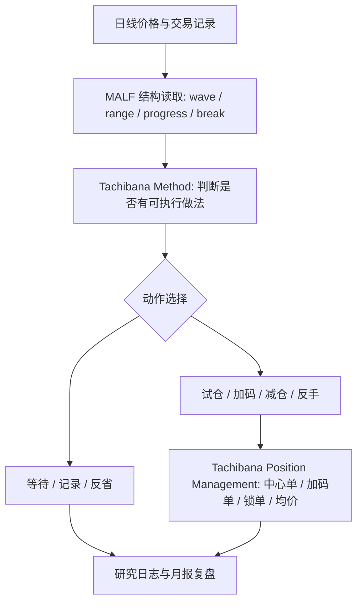

# Tachibana Method v1 定义草案

## 版本定位

- 本文件是 `Tachibana Method` 的第一版定义草案，基于已校引文、`1975-1976` 年先锋电子月报、交易依据分类表和 MALF 映射总表整理而成。
- 本文件定义“立花义正如何做交易、为什么这样做、哪些动作可被结构化”，不是交易信号实现，也不是 MALF 主定义修订。
- 本阶段只覆盖日线级别。立花专项研究暂不引入周线、月线、多周期氛围层。
- `PAS` 继续冻结；本文件不接管 PAS 的触发器职责。

## 权威来源与证据纪律

| 来源层级 | 文件入口 | 在本定义中的用途 |
|---|---|---|
| 一级事实源 | [1975 月报](../monthly/1975-01.md) 至 [1976-12](../monthly/1976-12.md)、先锋交易重建 JSON、24 张交易谱截图 | 证明“他实际做了什么” |
| 二级解释源 | [章节精读索引](./章节精读索引.md)、[逐页引文校勘表](./逐页引文校勘表.md) | 证明“书中如何解释这种做法” |
| 三级抽象源 | [立花交易依据分类表](./立花交易依据分类表.md)、[MALF-立花映射总表](./MALF-立花映射总表.md) | 形成可复用的方法分类和 MALF 边界 |

本文件中的判断必须区分四种性质：`事实`、`书中自述`、`我们的抽象解释`、`MALF 映射判断`。凡不能落到原文锚点或月份事实的内容，只能作为待验证假设。

## 定义范围

`Tachibana Method` 是一个日线波段交易方法层，负责把价格节奏、分批动作、等待、认错、反省和仓位处理组织成可复盘的交易过程。

它回答五个问题：

| 问题 | Method 层职责 | 不属于 Method 层的内容 |
|---|---|---|
| 何时考虑交易 | 识别是否处于可执行的波段节奏、回撤、推进、等待窗口 | 不直接计算 wave / range / probability |
| 做什么动作 | 给出试仓、加码、减仓、反手、等待等动作语义 | 不给出毫秒级触发，不替代订单执行 |
| 为什么不交易 | 把等待视为主动纪律，而不是无规则空白 | 不把所有无交易都硬解释成 range |
| 如何面对错误 | 接受失误、修正仓位、继续记录 | 不把认错写成 MALF 结构字段 |
| 如何沉淀技巧 | 通过记录、复盘、重复练习形成做法 | 不把一次预测成功等同于方法成熟 |

## 核心原则

| 原则代码 | 定义 | 原文锚点 | 1975 案例 | 方法含义 | MALF 关系 |
|---|---|---|---|---|---|
| `no_prediction_first` | 先放弃猜行情，把注意力转回可执行做法。 | [放棄「猜行情的交易方式」](../chapters/05-五章.md) `PDF p.33 / 图片 B0033` [廣告單沒有用](../chapters/05-五章.md) `PDF p.35 / 图片 B0035` | [1975-08](../monthly/1975-08.md)、[1975-09](../monthly/1975-09.md)、[1975-10](../monthly/1975-10.md) | 不因为有观点就交易；只有当做法可执行时才行动。 | MALF 可提供结构背景，但不能替代“不猜”的心理纪律。 |
| `staged_execution` | 建仓、加码、退出都采用分批，而不是一发压满。 | [分批買賣的基準](../chapters/07-七章.md) `PDF p.47 / 图片 B0047` [分三批買進，分三批出場](../chapters/15-五章.md) `PDF p.117 / 图片 B0115` | [1975-01](../monthly/1975-01.md)、[1975-02](../monthly/1975-02.md)、[1975-06](../monthly/1975-06.md)、[1975-11](../monthly/1975-11.md) | 分批不是机械切碎，而是让错误、确认、加码和退出都有余地。 | MALF 可描述每一批发生时的 wave/progress 位置，但不能决定批次数和手数。 |
| `practice_over_theory` | 技巧来自实战记录、复盘和修正，不来自抽象理论。 | [實踐比理論重要](../chapters/10-十章.md) `PDF p.69 / 图片 B0069` [整理書籍和資料反省](../chapters/10-十章.md) `PDF p.75 / 图片 B0075` [排除抽象理論](../chapters/14-四章.md) `PDF p.105 / 图片 B0105` | [1975-01](../monthly/1975-01.md)、[1975-06](../monthly/1975-06.md)、[1975-12](../monthly/1975-12.md) | 交易法必须能回到交易表、价格、部位、复盘，而不是漂亮解释。 | MALF 是结构工具，不是理论包装；必须接受交易事实检验。 |
| `active_waiting` | 等待是交易动作的一部分，不是系统缺失。 | [職業操作專家不要虛榮](../chapters/08-八章.md) `PDF p.53 / 图片 B0053` [整理書籍和資料反省](../chapters/10-十章.md) `PDF p.75 / 图片 B0075` | [1975-08](../monthly/1975-08.md)、[1975-09](../monthly/1975-09.md)、[1975-10](../monthly/1975-10.md) | 不出手也要有理由：等待、反省、观察、保护利润。 | MALF 可标出 range/no-progress，但不能把所有等待都自动归因于 range。 |
| `accept_and_correct` | 错误不可避免，关键是承认、缩小伤害并恢复节奏。 | [一發就中是失敗的根源](../chapters/09-九章-一.md) `PDF p.61 / 图片 B0061` [不再犯以前的錯誤](../chapters/12-二章.md) `PDF p.89 / 图片 B0089` [有決心的話，技巧一定會進步](../chapters/13-三章.md) `PDF p.103 / 图片 B0101` | [1975-03](../monthly/1975-03.md)、[1975-05](../monthly/1975-05.md)、[1975-06](../monthly/1975-06.md) | 认错不是道德姿态，而是仓位处理和方法延续的前提。 | MALF 可描述节奏失败或 break，但不能表达认错心理。 |
| `anti_vanity_profit_stability` | 稳定利润和长期存活优先于漂亮预测、面子和证明自己。 | [利潤的安定最重要](../chapters/08-八章.md) `PDF p.53 / 图片 B0053` [確保獲利和鎖單](../chapters/19-九章.md) `PDF p.145 / 图片 B0145` [這不是負面影響](../chapters/19-九章.md) `PDF p.147 / 图片 B0147` | [1975-07](../monthly/1975-07.md)、[1975-10](../monthly/1975-10.md)、[1975-12](../monthly/1975-12.md) | 利润保护、减仓、锁单和清仓都服务于生存，不服务于炫技。 | 利润保护属于 Position Management，不进入 MALF 主定义。 |

### 1976 新增校验

| 1976 样本 | 方法层启发 | 对原原则的影响 |
|---|---|---|
| [1976-10](../monthly/1976-10.md) `—10 -> —24` | 同向仓位可以先以较均衡小额方式推进。 | 支持 `staged_execution`。 |
| [1976-11](../monthly/1976-11.md) `—24 -> —200` | 加码可能从分批推进升级为极端仓位扩张。 | `staged_execution` 需要增加“仓位尺度警戒”。 |
| [1976-11](../monthly/1976-11.md) `—200 -> 0` | 节奏失败时可以一次性清仓，认错是动作，不只是心理。 | 强化 `accept_and_correct`。 |
| [1976-11](../monthly/1976-11.md) `—5 -> 0 -> —5 -> 35 —` | 清仓后重新小仓试探，再切换方向，不应视为原交易连续延伸。 | 强化 `trend_probe_entry` 与 `reversal_flip` 的边界。 |
| [1976-12](../monthly/1976-12.md) `35 — -> 150 — -> 0` | 疑似大仓位推进后收束，待精读。 | 将用于校验 `anti_vanity_profit_stability`。 |

## 动作分类定义

本节承接 [立花交易依据分类表](./立花交易依据分类表.md)，给每类动作补上 Method 层含义。

| 动作代码 | Method 层定义 | 1975 典型月份 | 主要心理标签 | 结构依赖 | 仓位依赖 |
|---|---|---|---|---|---|
| `trend_probe_entry` | 在方向可能形成但尚未完全确认时试探建仓，重点是开始进入节奏，而不是一次押中。 | [1975-01](../monthly/1975-01.md)、[1975-05](../monthly/1975-05.md)、[1975-07](../monthly/1975-07.md)、[1975-11](../monthly/1975-11.md) | `conviction / discipline / anti-guessing` | 需要观察 wave/range 位置 | 需要限定初始手数 |
| `trend_confirmation_add` | 原方向运行后继续加码，表示节奏获得进一步承认。 | [1975-01](../monthly/1975-01.md)、[1975-02](../monthly/1975-02.md)、[1975-06](../monthly/1975-06.md)、[1975-11](../monthly/1975-11.md) | `discipline / conviction / controlled-aggression` | 需要同向推进或回撤后重启 | 需要区分中心单和加码单 |
| `pullback_entry` | 借回撤进入，不在高潮中追价。 | [1975-01](../monthly/1975-01.md)、[1975-06](../monthly/1975-06.md)、[1975-10](../monthly/1975-10.md) | `patience / price-discipline` | 需要识别回撤是否仍在可交易节奏内 | 需要控制试仓风险 |
| `pullback_add` | 已有仓位后，在回撤和再推进中增加同向仓位。 | [1975-01](../monthly/1975-01.md)、[1975-02](../monthly/1975-02.md)、[1975-06](../monthly/1975-06.md) | `discipline / patience / inventory-awareness` | 需要 MALF 描述回撤和再推进 | 必须落入 Position Management |
| `distribution_reduce` | 对盈利或风险分批减仓，不把退出压缩成一个点。 | [1975-01](../monthly/1975-01.md)、[1975-04](../monthly/1975-04.md)、[1975-07](../monthly/1975-07.md) | `discipline / profit-protection` | 可参考推进衰竭、停滞、range | 属于利润保护和库存回收 |
| `exit_on_rhythm_failure` | 原节奏失效或仓位逻辑不成立时退出。 | [1975-05](../monthly/1975-05.md)、[1975-06](../monthly/1975-06.md)、[1975-08](../monthly/1975-08.md) | `accept_loss / self-correction / anti-vanity` | 可参考 break、no-progress、direction transition | 需要处理亏盈、剩余仓位、再进入 |
| `reversal_flip` | 平掉原方向并切换方向，是对原判断失效的操作承认。 | [1975-05](../monthly/1975-05.md)、[1975-06](../monthly/1975-06.md)、[1975-10](../monthly/1975-10.md) | `accept_loss / decision / execution` | MALF 可记录 break 或新 wave | 决策不属于 MALF，仓位重置属于 PM |
| `inventory_rebalance` | 围绕中心单、加码单、锁单、均价做库存调整。 | [1975-05](../monthly/1975-05.md)、[1975-06](../monthly/1975-06.md)、[1975-10](../monthly/1975-10.md)、[1975-12](../monthly/1975-12.md) | `inventory-awareness / restraint / risk-buffering` | MALF 只提供背景 | 核心属于 Position Management |
| `wait_no_action` | 主动等待，不因为必须交易而交易。 | [1975-08](../monthly/1975-08.md)、[1975-09](../monthly/1975-09.md)、[1975-10](../monthly/1975-10.md) | `patience / anti-guessing / anti-vanity` | 不能反向推断为 range | 不动仓或保护仓位都可能成立 |

## 方法流程

这个流程的关键是：MALF 在前面提供结构语言，Method 在中间决定“这是不是立花式可做的局”，Position Management 在后面决定“做多少、怎么保、怎么退”。

## 与 MALF 的接口

| MALF 输出 | Method 使用方式 | 禁止用法 |
|---|---|---|
| `wave / progress` | 辅助判断推进、回撤、停滞中的动作语境 | 不能直接生成买卖建议 |
| `range` | 辅助识别等待和无节奏环境 | 不能把所有等待都归因为 range |
| `break / birth_type` | 辅助描述新节奏、反手、回撤后再进入 | 不能把反手决策写进 MALF |
| `lifespan / probability` | 辅助观察节奏成熟或衰竭 | 不能替代分批、认错、仓位保护 |

因此，当前结论是：MALF 主定义暂不修订。立花方法中的中心单、锁单、均价、利润保护、去虚荣、认错，应由 `Tachibana Method` 和 `Tachibana Position Management` 承接。

## 最小可回测接口草案

后续如果进入回测，`Tachibana Method` 至少需要输出以下解释字段，而不是直接输出订单：

| 字段 | 类型 | 含义 |
|---|---|---|
| `method_action` | enum | 使用本文件的 9 类动作代码 |
| `method_reason` | list | 对应原则代码，如 `staged_execution`、`active_waiting` |
| `evidence_level` | enum | `fact / book_self_statement / our_interpretation / malf_mapping` |
| `source_anchor` | list | 月报链接、章节链接、PDF 页码、图片编号 |
| `malf_relation` | enum | `covered / approximate / partial / not_covered` |
| `pm_required` | boolean | 是否必须交给 Position Management 决定手数、中心单、锁单或均价 |

## 当前未解决问题

- 1976 年已开始纳入定义校验，但除 1976-10/11 外多数月份尚未精读。
- 真实 MALF 快照尚未跑完，`MALF 可近似覆盖` 仍是研究判断，不是实证结论。
- `wait_no_action` 现在混合了“等待”“保护”“锁单背景”“无明确节奏”等多种状态，后续可能需要拆分。
- `reversal_flip` 与 `exit_on_rhythm_failure` 的边界仍需通过更多月份案例校正。
- 选股原则目前只做了方法层定位，尚未形成 `Tachibana Stock Selection` 独立定义。
