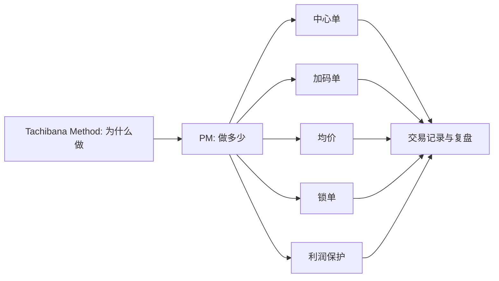

# Tachibana Position Management v1 定义草案

## 版本定位

- 本文件是 `Tachibana Position Management` 的第一版定义草案，专门承接立花方法中 MALF 当前无法覆盖的仓位管理部分。
- 它回答的问题不是“行情往哪里走”，而是“同样的价格结构下，为什么这样下、下多少、保留什么、锁住什么、什么时候收束”。
- 本文件与 [Tachibana Method v1 定义草案](./Tachibana-Method-雏形.md) 配套使用。Method 负责动作语义，Position Management 负责仓位结构和资金暴露。
- 本阶段只覆盖日线级别和 `1975-1976` 年先锋电子案例，不修改 MALF 主定义，不启用 PAS。

## 权威来源与证据纪律

| 来源层级 | 文件入口 | 在本定义中的用途 |
|---|---|---|
| 一级事实源 | [1975 月报](../monthly/1975-01.md) 至 [1976-12](../monthly/1976-12.md)、先锋交易重建 JSON、24 张交易谱截图 | 证明仓位变化、持仓方向、加减仓过程 |
| 二级解释源 | [第一章 操盤工具](../chapters/11-一章.md)、[第六章 開始使用鎖單](../chapters/16-六章.md)、[第八章 中心單和加碼單](../chapters/18-八章.md)、[第九章 確保獲利和鎖單](../chapters/19-九章.md) | 证明仓位工具、中心单、加码单、锁单、利润保护的书中位置 |
| 三级抽象源 | [立花交易依据分类表](./立花交易依据分类表.md)、[MALF-立花映射总表](./MALF-立花映射总表.md) | 形成仓位动作分类和 MALF 边界 |

本文件中的仓位解释必须区分 `事实`、`书中自述`、`我们的抽象解释`、`MALF 映射判断`。不能因为月表出现双向仓位，就自动推断其心理动机；必须保留“我们的抽象解释”标签。

## 定义范围

`Tachibana Position Management` 是立花日线波段交易法中的仓位管理层，负责定义中心单、加码单、均价、锁单、分批退出、利润保护和库存再平衡。

它处理五类问题：

| 问题 | PM 层职责 | 不属于 PM 层的内容 |
|---|---|---|
| 仓位骨架是什么 | 区分中心单、加码单、临时单、锁单 | 不判断价格结构是否成立 |
| 手数如何变化 | 解释分批、加码、减码、清仓、反手后的仓位重置 | 不替代 Method 判断“为什么做” |
| 风险如何缓冲 | 解释锁单、减仓、库存再平衡 | 不把锁单解释成 MALF 信号 |
| 利润如何保护 | 解释分批兑现、保留母单、收束交易 | 不保证最大化利润 |
| 记录如何服务仓位 | 使用均价和持仓记录维持秩序 | 不处理数据清洗和行情生成 |

## 仓位词汇表

| 术语 | 工作定义 | 原文锚点 | 1975 典型月份 | 与 MALF 的关系 |
|---|---|---|---|---|
| `center_position` / 中心单 | 一段交易中的仓位骨架，代表交易者愿意围绕其继续处理的核心方向暴露。 | [中心單和加碼單](../chapters/18-八章.md) `PDF p.137 / 图片 B0137` | [1975-01](../monthly/1975-01.md)、[1975-06](../monthly/1975-06.md)、[1975-10](../monthly/1975-10.md) | MALF 不能输出中心单；只能提供其所处结构背景。 |
| `add_on_position` / 加码单 | 围绕中心单追加的同向仓位，服务于节奏推进或回撤后的再进入。 | [加碼放空](../chapters/17-七章.md) `PDF p.129 / 图片 B0129` [加碼放空成功的秘訣](../chapters/17-七章.md) `PDF p.133 / 图片 B0131` | [1975-02](../monthly/1975-02.md)、[1975-03](../monthly/1975-03.md)、[1975-06](../monthly/1975-06.md)、[1975-11](../monthly/1975-11.md) | MALF 可描述加码时的 progress/break，但不能决定加码手数。 |
| `average_price` / 部位均价 | 用于理解持仓成本和仓位压力的记录工具，不是价格结构自然产物。 | [部位的均價](../chapters/11-一章.md) `PDF p.81 / 图片 B0081` | [1975-01](../monthly/1975-01.md)、[1975-06](../monthly/1975-06.md)、[1975-07](../monthly/1975-07.md) | 完全不属于 MALF，应由 PM 单独记录。 |
| `lock_position` / 锁单 | 同时保留相反方向仓位，以缓冲风险、保护利润或争取判断时间。 | [開始使用鎖單](../chapters/16-六章.md) `PDF p.121 / 图片 B0121` [確保獲利和鎖單](../chapters/19-九章.md) `PDF p.145 / 图片 B0145` | [1975-05](../monthly/1975-05.md)、[1975-06](../monthly/1975-06.md)、[1975-10](../monthly/1975-10.md) | MALF 当前无法覆盖；锁单是库存和风险动作。 |
| `distribution_reduce` / 分批减仓 | 分批收回风险或兑现利润，不把退出压缩成单一判断点。 | [分三批買進，分三批出場](../chapters/15-五章.md) `PDF p.117 / 图片 B0115` [這不是負面影響](../chapters/19-九章.md) `PDF p.147 / 图片 B0147` | [1975-01](../monthly/1975-01.md)、[1975-04](../monthly/1975-04.md)、[1975-07](../monthly/1975-07.md)、[1975-12](../monthly/1975-12.md) | MALF 可提示停滞或衰竭，不能替代利润保护动作。 |
| `inventory_rebalance` / 库存再平衡 | 围绕多空库存、中心单、加码单、锁单和均价进行调整。 | [於緊張一個星期中完成放空](../chapters/16-六章.md) `PDF p.125 / 图片 B0125` [我無法把日本電氣虧損的錢賺回來的原因](../chapters/18-八章.md) `PDF p.143 / 图片 B0141` | [1975-05](../monthly/1975-05.md)、[1975-06](../monthly/1975-06.md)、[1975-10](../monthly/1975-10.md)、[1975-12](../monthly/1975-12.md) | MALF 只能提供结构上下文，不能管理库存。 |

### 1976 新增 PM 样本

| 样本 | PM 现象 | 定义影响 |
|---|---|---|
| [1976-10](../monthly/1976-10.md) `—10 -> —24` | 均衡小额加码形成右侧中心单候选。 | 支持 `center_position` 与 `add_on_position` 的分层。 |
| [1976-11](../monthly/1976-11.md) `—24 -> —200` | 围绕中心单候选发生极端加码。 | PM 需要新增“加码尺度警戒”概念。 |
| [1976-11](../monthly/1976-11.md) `—200 -> 0` | 一次性清仓，不是分批减仓。 | `pm_action` 中 `clear` 的重要性上升。 |
| [1976-11](../monthly/1976-11.md) `—5 -> 0 -> —5` | 清仓后小仓重新试探。 | 不能把小仓试探并入旧中心单。 |
| [1976-11](../monthly/1976-11.md) `—5 -> 35 —` | 方向切换并形成新中心单候选。 | `reversal_flip` 后中心单应重置。 |
| [1976-12](../monthly/1976-12.md) `35 — -> 150 — -> 0` | 大仓位推进后，按 `150 — -> 100 — -> 50 — -> 0` 三段式退出。 | 支持 `distribution_reduce`、`clear` 与 `protect_profit_before_vanity`，并证明利润保护应进入 PM 而不是 MALF。 |
| [1976-04](../monthly/1976-04.md) `— 10 -> 2 — 20 -> 4 — 5` | 前置右侧库存转为双侧库存，再逐步收束。 | 支持 `inventory_rebalance`、`lock_candidate` 与双侧均价字段；但不能仅凭双侧记录判定为锁单。 |
| [1976-03](../monthly/1976-03.md) `—12 -> 0 -> —10` | 右侧库存先清零，再重新建立月末 `—10`。 | 支持 `reset_after_clear` 与 `inventory_seed`，说明 4 月双侧库存有明确前置来源。 |
| [1976-05](../monthly/1976-05.md) `4 — 5 -> 10 — 5 -> 10 — -> 0` | 4 月双侧库存跨月延续，先解除右侧，再最终清仓。 | 支持 `unlock`、`clear` 与 `dual_inventory_chain`，增强 4 月 `lock_candidate` 的可信度。 |

## 仓位原则

| 原则代码 | 定义 | 支撑锚点 | 1975 案例 | 说明 |
|---|---|---|---|---|
| `preserve_core_then_adjust` | 先识别是否存在中心单，再决定围绕它加码、减仓或锁单。 | [中心單和加碼單](../chapters/18-八章.md) `PDF p.137 / 图片 B0137` | [1975-01](../monthly/1975-01.md)、[1975-06](../monthly/1975-06.md) | 中心单不是固定永不动，而是当前交易段的骨架。 |
| `add_only_with_context` | 加码必须有节奏和仓位背景，不能因为盈利或冲动任意扩大。 | [加碼並不是趨勢操作，是在回檔時買進的](../chapters/16-六章.md) `PDF p.125 / 图片 B0123` [加碼放空](../chapters/17-七章.md) `PDF p.129 / 图片 B0129` | [1975-02](../monthly/1975-02.md)、[1975-06](../monthly/1975-06.md)、[1975-11](../monthly/1975-11.md) | 这条原则直接防止把加码退化成追涨杀跌。 |
| `average_price_awareness` | 每次增减仓都会改变均价压力，必须被记录和复盘。 | [部位的均價](../chapters/11-一章.md) `PDF p.81 / 图片 B0081` | [1975-01](../monthly/1975-01.md)、[1975-07](../monthly/1975-07.md) | 均价是心理压力和风险感知的重要来源。 |
| `lock_as_buffer_not_signal` | 锁单是缓冲和保护动作，不是新的方向信号。 | [開始使用鎖單](../chapters/16-六章.md) `PDF p.121 / 图片 B0121` [確保獲利和鎖單](../chapters/19-九章.md) `PDF p.145 / 图片 B0145` | [1975-05](../monthly/1975-05.md)、[1975-10](../monthly/1975-10.md) | 回测时不能把锁单当成普通反手。 |
| `protect_profit_before_vanity` | 利润保护优先于追求完美预测和漂亮持仓。 | [利潤的安定最重要](../chapters/08-八章.md) `PDF p.53 / 图片 B0053` [這不是負面影響](../chapters/19-九章.md) `PDF p.147 / 图片 B0147` | [1975-07](../monthly/1975-07.md)、[1975-12](../monthly/1975-12.md) | 仓位收缩不等于看错，可能是职业纪律。 |

## 仓位动作矩阵

| Method 动作 | PM 解释 | 是否需要中心单 | 是否可能涉及锁单 | 1975 入口 |
|---|---|---|---|---|
| `trend_probe_entry` | 建立初始仓位，可能形成未来中心单。 | 可能 | 否 | [1975-01](../monthly/1975-01.md)、[1975-05](../monthly/1975-05.md)、[1975-07](../monthly/1975-07.md) |
| `trend_confirmation_add` | 在中心单或原方向基础上增加加码单。 | 是 | 通常否 | [1975-02](../monthly/1975-02.md)、[1975-06](../monthly/1975-06.md)、[1975-11](../monthly/1975-11.md) |
| `pullback_entry` | 回撤中建立试探仓位，先小后看。 | 可能 | 否 | [1975-01](../monthly/1975-01.md)、[1975-10](../monthly/1975-10.md) |
| `pullback_add` | 利用回撤后节奏继续围绕中心单加码。 | 是 | 通常否 | [1975-02](../monthly/1975-02.md)、[1975-06](../monthly/1975-06.md) |
| `distribution_reduce` | 分批回收加码单或缩小中心单，保护利润。 | 是 | 可能 | [1975-01](../monthly/1975-01.md)、[1975-04](../monthly/1975-04.md)、[1975-07](../monthly/1975-07.md) |
| `exit_on_rhythm_failure` | 清掉失效仓位，或先降到可承受规模。 | 可能 | 可能 | [1975-05](../monthly/1975-05.md)、[1975-06](../monthly/1975-06.md) |
| `reversal_flip` | 原方向退出后重新建立反向仓位，中心单可能重置。 | 重置 | 可能 | [1975-06](../monthly/1975-06.md)、[1975-10](../monthly/1975-10.md) |
| `inventory_rebalance` | 在多空库存、锁单、中心单、加码单之间调整。 | 是 | 是 | [1975-05](../monthly/1975-05.md)、[1975-10](../monthly/1975-10.md)、[1975-12](../monthly/1975-12.md) |
| `wait_no_action` | 不变动仓位，或只观察已有仓位压力。 | 可能 | 可能 | [1975-08](../monthly/1975-08.md)、[1975-09](../monthly/1975-09.md) |

## 与 Tachibana Method 的接口

接口原则：

- Method 可以提出 `trend_confirmation_add`，但 PM 决定它是增加中心单、增加加码单，还是因为均价压力过高而拒绝加码。
- Method 可以提出 `distribution_reduce`，但 PM 决定先减加码单、减中心单，还是用锁单保护。
- Method 可以提出 `wait_no_action`，但 PM 必须记录等待期间的库存、均价和潜在压力。

## 与 MALF 的边界

| 内容 | 是否进入 MALF | 归属 |
|---|---|---|
| wave / range / progress / break | 是 | MALF |
| 试仓发生时的结构位置 | 部分 | MALF + Method |
| 加码是否同向推进 | 部分 | MALF + Method |
| 中心单 | 否 | Position Management |
| 加码单手数 | 否 | Position Management |
| 部位均价 | 否 | Position Management |
| 锁单 | 否 | Position Management |
| 利润保护 | 否 | Position Management + Method |
| 认错、去虚荣、克制 | 否 | Tachibana Method |

当前判断：MALF 主定义不需要为了立花仓位艺术而修订。正确做法是在 MALF 后新增 PM 层，让 MALF 保持结构事实的干净边界。

## 最小回测接口草案

后续进入回测时，PM 层至少需要维护以下状态字段：

| 字段 | 类型 | 含义 |
|---|---|---|
| `gross_long` | number | 多头总手数 |
| `gross_short` | number | 空头总手数 |
| `net_position` | number | 净持仓 |
| `center_side` | enum | 当前中心单方向：`long / short / none / mixed` |
| `center_size` | number | 中心单估计手数 |
| `add_on_size` | number | 加码单估计手数 |
| `average_price_long` | number/null | 多头均价 |
| `average_price_short` | number/null | 空头均价 |
| `lock_size` | number | 双向锁定规模 |
| `pm_action` | enum | `open_center / add_on / reduce_add_on / reduce_center / inventory_seed / lock / lock_candidate / unlock / rebalance / clear` |
| `pm_reason` | list | `preserve_core_then_adjust`、`add_only_with_context` 等原则代码 |
| `source_anchor` | list | 月报链接、章节链接、PDF 页码、图片编号 |

这些字段是为了回放和研究，不等于已经给出最终交易规则。

## 当前未解决问题

- `center_position` 的自动识别规则尚未确定。现在只能基于月报和书中解释做人工标注。
- 锁单与普通反手的判别需要更精细的交易事实和书页校勘，不能只凭双向仓位判断；1976-04 应先标为 `lock_candidate`。
- 均价计算需要与重建 JSON 的价格字段严格对齐，后续回测前必须单独校验。
- 1976-03/04/05/11/12 已纳入 PM 定义验证；3-5 月已经构成第一条可追踪的双侧库存链。
- 选股与仓位规模的关系尚未定义，未来可能需要新增 `Tachibana Stock Selection` 或并入 Method。
- 1976-11 已证明 `clear`、`center reset`、`add-on scale alert` 需要进入下一版 PM 规则。
- 1976-12 已证明大仓位退出不一定是一次性清仓，也可能是规则化的三段式 `distribution_reduce -> clear`。
