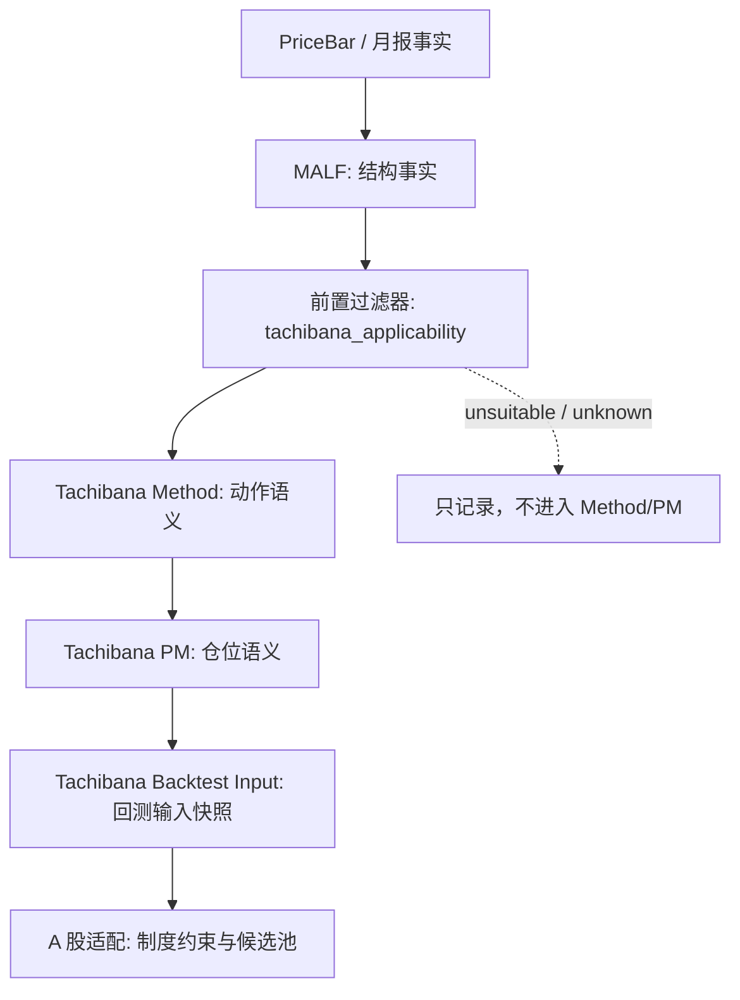

# Tachibana 分层边界审计 v0.1

## 版本定位

- 本文件是立花义正波段交易法与 MALF / Method / PM / A 股适配之间的分层边界审计。
- 它承接 [MALF-立花前置认知过滤器 v0.1](./MALF-立花前置认知过滤器-v0.1.md) 和 [MALF-立花结构资格样本表 v0.1](./MALF-立花结构资格样本表-v0.1.md)。
- 它不新增交易规则，不修改 MALF 主定义，不做 A 股制度适配。
- 它只回答：某个概念、字段、动作或解释应该归哪一层，不能回流到哪一层。

## 总原则

| 层级 | 唯一职责 | 严禁 |
|---|---|---|
| `MALF` | 结构事实、Range、Lifespan、Probability 位姿。 | 中心单、锁单、认错心理、仓位手数、买卖建议。 |
| `MALF-立花前置过滤器` | 判断 MALF 背景是否值得进入立花 Method / PM 讨论。 | 输出交易动作、替 Method 解释原因、替 PM 定手数。 |
| `Tachibana Method` | 解释为什么做、为什么等、为什么认错或修正。 | 计算 wave、决定仓位手数、改写 A 股制度。 |
| `Tachibana PM` | 解释中心单、加码单、均价、锁单、减仓、清仓。 | 判断市场结构是否成立、把库存动作写回 MALF。 |
| `Tachibana Backtest Input` | 把结构资格、Method 动作与 PM 仓位语义整理成回测可读快照。 | 输出 Signal 裁决、绕过 Method / PM、替 A 股制度下定义。 |
| `Tachibana A-Share Adaptation` | 处理 T+1、涨跌停、停牌、板块、流动性、选股池。 | 反向解释原始立花交易谱、改写 MALF 主定义。 |

## 边界裁判表

| 事项 | 归属层 | 可读上游 | 输出 | 禁止回流 |
|---|---|---|---|---|
| `wave / range / break / birth_type` | MALF | PriceBar | 结构事实 / 概率位姿 | Method / PM 不得重算 |
| `tachibana_applicability` | 前置过滤器 | MALF snapshot / 月报证据 | `suitable / conditional / unsuitable / unknown` | 不得变成 Signal accept/reject |
| `trend_probe_entry` | Method | 前置过滤器 / 月报 / 章节 | 动作语义 | 不得变成 MALF setup |
| `trend_confirmation_add` | Method + PM | 前置过滤器 / 月报 / PM 状态 | 加码语义 + 仓位解释 | 不得由 MALF 决定手数 |
| `distribution_reduce` | Method + PM | 前置过滤器 / 月报 / PM 状态 | 减仓或利润保护解释 | 不得写成 MALF 衰竭信号 |
| `exit_on_rhythm_failure` | Method + PM | 前置过滤器 / 月报 / PM 状态 | 节奏失败后的动作解释 | 不得写成 MALF 认错字段 |
| `reversal_flip` | Method + PM | MALF break/birth 背景 / 月报 | 反手动作与仓位重置解释 | 不得让 break 自动等于反手 |
| `wait_no_action` | Method | 前置过滤器 / 月报 / 章节 | 主动等待解释 | 不得把无交易自动判为 range |
| `center_position` | PM | Method 动作 / 月报 / 交易记录 | 中心单候选或中心单解释 | 不得写入 MALF |
| `add_on_position` | PM | Method 动作 / 月报 / 交易记录 | 加码单解释 | 不得由 MALF 输出数量 |
| `average_price` | PM | 交易记录 | 仓位压力与成本记录 | 不得进入 MALF |
| `lock_position` | PM | 月报 / 章节 / 交易记录 | 锁单或 `lock_candidate` | 不得把双侧库存自动等于锁单 |
| `TachibanaBacktestInputSnapshot` | Backtest Input | 前置过滤器 / 横向矩阵 / Method / PM | 回测输入快照 | 不得变成 Signal accept/reject/defer |
| `A 股 T+1 / 涨跌停 / 停牌` | A 股适配 | Data / 交易制度资料 / PM 状态 | 制度约束、执行限制 | 不得反向解释 1975-1976 原始交易 |
| `A 股选股池` | A 股适配 | MALF 资格样本 / Data / 行业资料 | 候选池与样本分层 | 不得变成买卖信号 |

## 典型越界场景

| 越界写法 | 为什么错 | 正确归属 |
|---|---|---|
| `MALF 判断这里应该加码` | MALF 只给结构背景，不做动作。 | 前置过滤器判资格，Method 解释加码语义，PM 解释加码单。 |
| `break 出现，所以必须反手` | break 是结构事实，不是反手决策。 | Method 判断 `reversal_flip`，PM 处理中心单重置。 |
| `无交易月份就是 range` | 无交易可能是纪律、等待、保护、资料整理。 | 前置过滤器最多标 `conditional`，Method 解释 `wait_no_action`。 |
| `双侧库存就是锁单` | 双侧记录不足以证明锁单动机。 | PM 先标 `lock_candidate`，等待章节或交易链证据。 |
| `A 股 T+1 要求修改原始立花法` | A 股制度只能进入适配版。 | A 股适配层处理，原始法保持独立。 |
| `A 股涨跌停改变 MALF wave 定义` | 制度造成的交易限制不修改 MALF 主定义。 | Data/Backtest/A 股约束记录制度状态，MALF 仍读价格结构。 |

## 分层流程

## 对现有文档的审计结论

| 文档 | 当前状态 | 下一步 |
|---|---|---|
| [MALF-立花映射总表](./MALF-立花映射总表.md) | 已声明映射结论不能直接进入 Method / PM。 | 继续保留为映射层，不增加适用性裁决。 |
| [MALF-立花前置认知过滤器 v0.1](./MALF-立花前置认知过滤器-v0.1.md) | 已成为总闸门。 | 后续接真实 MALF 快照。 |
| [MALF-立花结构资格样本表 v0.1](./MALF-立花结构资格样本表-v0.1.md) | 已开始承接样本。 | 扩展 pending 月份和交易段级样本。 |
| [Tachibana Method v1 定义草案](./Tachibana-Method-雏形.md) | 已声明只在过滤器通过后解释动作。 | 后续拆分 `wait_no_action` 与 `reversal_flip` 边界。 |
| [Tachibana Position Management v1 定义草案](./Tachibana-Position-Management-雏形.md) | 已声明 PM 不直接从 MALF 推导仓位。 | 后续补 `center_position` 自动识别前的人工标注规则。 |
| [Tachibana Backtest Input 适配层草案 v0.1](./Tachibana-Backtest-Input-适配层草案-v0.1.md) | 已承接横向矩阵、Method 与 PM，形成 `TachibanaBacktestInputSnapshot` 字段草案。 | 已完成 [1976 段级样本试填审计](./TachibanaBacktestInput-1976段级样本试填审计-v0.1.md) 与 [1975-06 试填审计](./TachibanaBacktestInput-1975-06段级样本试填审计-v0.1.md)。 |
| [Tachibana A-Share Adaptation v0 定义草案](./Tachibana-A股适配版-雏形.md) | 已声明不修订 MALF 主定义。 | 后续把前置过滤器作为 A 股选股池前置条件。 |
| [Tachibana A 股候选股票结构资格样本表 v0.1](./Tachibana-A股候选股票结构资格样本表-v0.1.md) | 已建立 A 股候选股票进入 Method / PM 前的结构资格字段。 | 后续填入真实 A 股元数据与 MALF 快照。 |
| [Tachibana A 股候选股票数据接入审计 v0.1](./Tachibana-A股候选股票数据接入审计-v0.1.md) | 已确认当前正式数据目录为空，缺少 A 股元数据、日线窗口、申万标签和 MALF 快照。 | 后续导入最小接入包。 |
| [Tachibana A 股最小接入包字段契约 v0.1](./Tachibana-A股最小接入包字段契约-v0.1.md) | 已定义 A 股最小接入包字段、校验、禁止字段与跨文件升级闸门。 | 后续按契约验收第一批真实 A 股候选数据。 |
| [Tachibana A 股最小接入包验收报告 v0.1](./Tachibana-A股最小接入包验收报告-v0.1.md) | 已将当前接入包判为 `intake_package_status=missing`、`contract_check_result=fail`。 | 后续补齐真实数据后重新验收。 |
| [Tachibana A 股最小接入包复核流程 v0.1](./Tachibana-A股最小接入包复核流程-v0.1.md) | 已定义数据到位后从文件存在性、字段契约、跨文件一致性到 MALF 快照与候选样本表的复核顺序。 | 后续按流程把 `contract_check_result` 推进到 `warn/pass`。 |
| [Tachibana A 股结构资格判定记录模板 v0.1](./Tachibana-A股结构资格判定记录模板-v0.1.md) | 已定义单只股票、单个窗口从数据复核到前置过滤器裁决的判定底稿。 | 后续真实样本必须先填底稿，再更新候选样本表。 |
| [Tachibana A 股结构资格判定记录 ASHARE-PENDING v0.1](./Tachibana-A股结构资格判定记录-ASHARE-PENDING-v0.1.md) | 已将 `ASHARE-PENDING-001/002/003` 明确记录为 `blocked`、`tachibana_applicability=unknown`。 | 后续真实数据到位后以真实底稿替代 pending 阻断样例。 |
| [Tachibana A 股结构资格升级闸门检查清单 v0.1](./Tachibana-A股结构资格升级闸门检查清单-v0.1.md) | 已定义 `unknown -> universe_candidate -> structure_candidate -> tachibana_candidate -> Backtest Input` 的逐级升级条件和禁止跳级表。 | 后续真实样本必须按闸门逐级升级。 |
| [Tachibana A 股结构资格理由码表 v0.1](./Tachibana-A股结构资格理由码表-v0.1.md) | 已统一 `failed_contract_items / rule_match_reason / applicability_reason / boundary_warning / next_action` 的受控理由码。 | 后续新增理由码先入表，再写底稿。 |
| [Tachibana Data / Signal / Backtest 接口边界审计 v0.1](./Tachibana-Data-Signal-Backtest-接口边界审计-v0.1.md) | 已审计通用接口能否承接 Tachibana 过滤器。 | 已由 Tachibana Backtest Input 适配层承接。 |

## 当前结论

- 第 1 步已经形成 `映射 -> 过滤器 -> 样本表` 的结构资格框架。
- 第 2 步的核心边界是：MALF 不碰 Method / PM，Method 不碰仓位数量，PM 不碰结构判定，A 股适配不反向污染原始法。
- 第 3 步已经形成接口边界审计：Data / System Collaboration 不需修订，Signal / Backtest 需要 Tachibana 专用接缝而不是改通用定义。
- 第 4 步已经形成样本表与横向判读矩阵；当前已把矩阵接入 `TachibanaBacktestInputSnapshot` 草案。
- `1976-03/04/05/07/11/12` 与 `1975-06` 已完成第一轮 Backtest Input 试填；A 股候选股票结构资格样本表已建立，数据接入审计已确认缺口，最小接入包字段契约、验收报告、复核流程、判定记录模板、pending 阻断态底稿、升级闸门清单与理由码表已建立，下一步补齐真实 A 股候选数据后按流程重新验收并逐级升级，仍不进入制度规则改造。
